# Cloud Computing & DevOps – Revision Notes

## What is DevOps?
DevOps is a set of practices that combines **software development (Dev)** and **IT operations (Ops)**. Its goal is to shorten the development life cycle and provide continuous delivery of high‑quality software.

### Key pillars of DevOps
1. **Continuous Deployment** – Automatically deploy every code change that passes automated tests to production.
2. **Automation** – Automate repetitive tasks (building, testing, deploying, infrastructure provisioning).
3. **Code Quality** – Enforce standards, static analysis, peer reviews, and automated testing to catch bugs early.
4. **Monitoring & Observability** – Track application performance, logs, metrics, and alerts to detect and fix issues in real time.

> 💡 **Why DevOps exists** – Traditional silos between developers and operations led to slow releases, finger‑pointing, and manual errors. DevOps aligns people, processes, and tools to deliver value faster and more reliably.

---

## DevOps vs Old (Traditional) System

### Old System (Waterfall / Siloed)
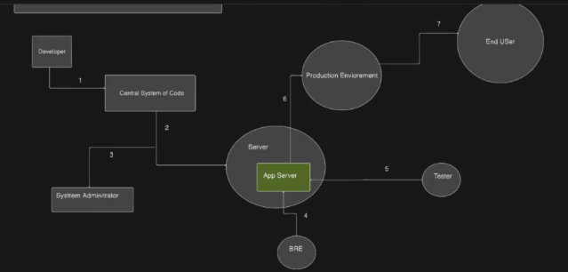  
*Characteristics:*  
- Dev writes code → throws it over the wall to Ops.  
- Manual deployment, long release cycles (months).  
- Error‑prone, hard to roll back.  
- Ops often discovers environment issues too late.

### New System (DevOps)
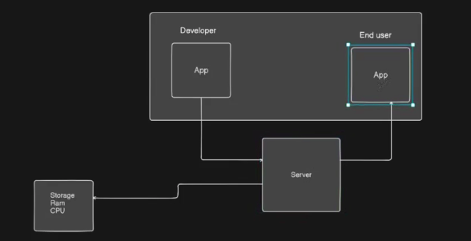  
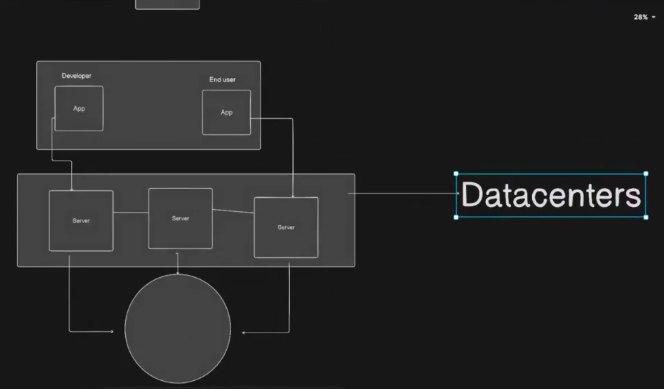  
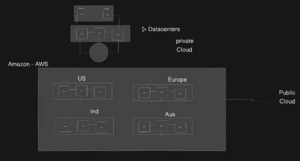  
*Characteristics:*  
- Shared responsibility, continuous integration & delivery (CI/CD).  
- Infrastructure as Code (IaC) – servers, networks, and storage are defined in code.  
- Automated testing, deployment, and monitoring.  
- Faster feedback loops and higher stability.

---

## What is Cloud Computing?
**Cloud computing** is the on‑demand delivery of IT resources (compute, storage, databases, networking) over the internet with pay‑as‑you‑go pricing. You don’t own the physical hardware; you rent it from a cloud provider.

### Main deployment models
| Model | Description |
|-------|-------------|
| **Public cloud** | Services offered over the public internet by providers like AWS, Azure, GCP. Shared infrastructure, but your data/logic is isolated. |
| **Private cloud** | Cloud environment dedicated solely to one organisation (on‑premises or hosted by a third party). More control, less scalability. |
| **Hybrid cloud** | Combination of public + private clouds, allowing data and apps to move between them (e.g., burst to public cloud for extra capacity). |
| **Multi‑cloud** | Using two or more public cloud providers simultaneously to avoid vendor lock‑in or for best‑of‑breed services. |

### Why cloud computing exists
- **Eliminate upfront infrastructure costs** – no need to buy servers.  
- **Elasticity** – scale up/down automatically based on demand.  
- **Global reach** – deploy near users anywhere.  
- **Reliability** – built‑in redundancy and disaster recovery.  
- **Focus on code** – operators manage the hardware, you focus on applications.

---

## The Relationship Between DevOps and Cloud Computing

| Aspect | How they work together |
|--------|------------------------|
| **Automation** | Cloud APIs enable scripted provisioning (Terraform, CloudFormation). DevOps pipelines call these APIs to create/destroy environments on the fly. |
| **Continuous Deployment** | Cloud provides managed CI/CD services (AWS CodePipeline, Azure DevOps, GitHub Actions) and deployment targets (Kubernetes, serverless). |
| **Monitoring** | Cloud services (CloudWatch, Azure Monitor, GCP Operations) feed logs/metrics directly into DevOps dashboards (Prometheus, Grafana, Datadog). |
| **Scalability** | Cloud auto‑scaling groups ensure apps handle load without manual ops intervention – a core DevOps goal. |
| **Infrastructure as Code (IaC)** | Cloud resources are defined in declarative files (e.g., YAML) and versioned alongside application code. The same DevOps tooling (Git, CI) manages both. |

> 🔁 **Why both exist together** – Cloud provides the **on‑demand, programmable infrastructure** that makes DevOps practices (like automated deployment and dynamic scaling) truly effective. Conversely, DevOps provides the **automation and culture** needed to manage cloud environments at scale. They reinforce each other.

---

## Quick Revision Table – Key Terms

| Term | One‑line definition |
|------|----------------------|
| DevOps | Dev + Ops collaboration using automation and monitoring to deliver software continuously. |
| Continuous Deployment | Every code change that passes tests is automatically released to production. |
| Infrastructure as Code | Managing infrastructure (networks, VMs, load balancers) using code and version control. |
| Public Cloud | Third‑party provider delivers services over the internet, shared but isolated. |
| Hybrid Cloud | Mix of on‑premises (private) and public cloud. |
| Multi‑cloud | Using multiple public cloud providers (e.g., AWS + Azure). |

# Cloud Computing & DevOps – Revision Notes

## What is DevOps?
DevOps is a set of practices that combines **software development (Dev)** and **IT operations (Ops)**. Its goal is to shorten the development life cycle and provide continuous delivery of high‑quality software.

### Key pillars of DevOps
1. **Continuous Deployment** – Automatically deploy every code change that passes automated tests to production.
2. **Automation** – Automate repetitive tasks (building, testing, deploying, infrastructure provisioning).
3. **Code Quality** – Enforce standards, static analysis, peer reviews, and automated testing to catch bugs early.
4. **Monitoring & Observability** – Track application performance, logs, metrics, and alerts to detect and fix issues in real time.

> 💡 **Why DevOps exists** – Traditional silos between developers and operations led to slow releases, finger‑pointing, and manual errors. DevOps aligns people, processes, and tools to deliver value faster and more reliably.

---

## What does a DevOps Engineer work on? (Day‑to‑day)

| Responsibility | What they actually do |
|----------------|------------------------|
| **CI/CD Pipelines** | Build & maintain pipelines (Jenkins, GitLab CI, GitHub Actions) that automatically build, test, and deploy code. |
| **Infrastructure as Code (IaC)** | Write Terraform, CloudFormation, or Pulumi scripts to provision servers, networks, databases. |
| **Configuration Management** | Use Ansible, Puppet, Chef to keep servers in a desired state (e.g., installed packages, config files). |
| **Containerisation & Orchestration** | Create Dockerfiles, manage Kubernetes clusters (EKS, AKS, GKE) for scaling microservices. |
| **Monitoring & Logging** | Set up Prometheus, Grafana, ELK stack, CloudWatch – create dashboards and alerts. |
| **Security & Compliance** | Implement secrets management (Vault, AWS Secrets Manager), scan images for vulnerabilities, enforce IAM roles. |
| **Collaboration** | Work with developers to optimise builds, with QA to automate tests, with security to embed “shift‑left” practices. |
| **Cloud Cost Optimisation** | Analyse cloud spend, right‑size instances, use spot instances, set budgets. |

---

## SDLC Concepts

### What is the Software Development Life Cycle (SDLC)?
The SDLC is a structured process used by development teams to design, build, test, deploy, and maintain high‑quality software.

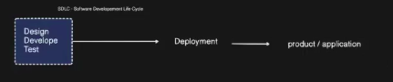

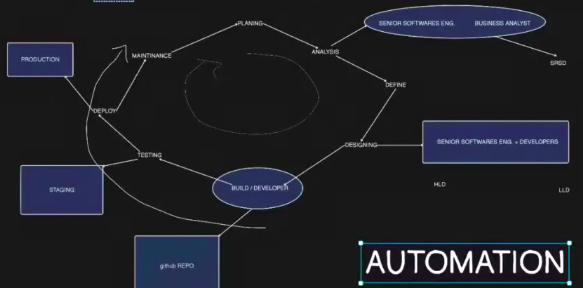

**Typical phases of SDLC** (and what a DevOps engineer does in each):

| Phase | DevOps involvement |
|-------|--------------------|
| **Planning** | Participate in sizing, define infrastructure needs, estimate cloud costs. |
| **Design (HLD/LLD)** | Help with high‑level & low‑level design decisions – e.g., microservices vs monolith, database selection, network topology. |
| **Development** | Provide local dev environments (Docker Compose, Vagrant), pre‑commit hooks for linting/testing. |
| **Testing** | Automate unit, integration, and end‑to‑end tests in CI pipelines; provision ephemeral test environments. |
| **Deployment** | Automate rollout (blue/green, canary), manage feature flags, auto rollbacks. |
| **Operation & Monitoring** | Set up observability stack, on‑call rotations, auto‑scaling, incident response. |
| **Maintenance** | Patch OS/images, rotate credentials, migrate data, handle deprecations without downtime. |

> 🔁 A DevOps engineer’s job is to **automate the whole SDLC process** – from code commit to production monitoring.

---

## Where DevOps and Cloud Computing fit in the SDLC Process

| SDLC Phase | How DevOps helps | How Cloud helps |
|------------|------------------|------------------|
| **Plan** | Version control all work (Git), track work items (Jira) | Estimate cloud costs with pricing calculators |
| **Design** | Infrastructure design reviewed as code (IaC) | Use managed services (RDS, S3, Lambda) to reduce ops burden |
| **Develop** | Local containerised dev environment matches production | Cloud dev environments (GitHub Codespaces, Cloud9) |
| **Test** | Automated testing in CI pipeline | Spin up test environments on demand (cheap, fast) |
| **Deploy** | CI/CD pipeline deploys after tests pass | Blue/green, canary deployments using load balancers |
| **Operate** | Centralised logging & monitoring dashboards | Auto‑scaling groups, serverless (no server to manage) |
| **Maintain** | Infrastructure as Code makes changes repeatable & auditable | Cloud snapshots, disaster recovery across regions |

---

## How DevOps and Cloud accelerate software delivery

| Challenge before | With DevOps + Cloud |
|------------------|----------------------|
| Provisioning servers takes weeks | Cloud – minutes with IaC |
| Manual testing & deployment (error prone) | Automated CI/CD pipelines |
| Environment drift (dev ≠ prod) | Immutable infrastructure, containerisation |
| Hard to scale for peak traffic | Auto‑scaling, load balancers |
| Long lead time to fix bugs | Continuous monitoring + fast rollback |
| High upfront hardware cost | Pay‑as‑you‑go, no waste |

> 📈 **Result** – Deployment frequency increases, lead time for changes drops from months to hours, recovery time from failures is seconds/minutes.

---

## CI / CD / Continuous Deployment – Clear Definitions

| Term | Meaning |
|------|---------|
| **CI (Continuous Integration)** | Developers **push code to GitHub** (or any Git repo) frequently. Each push triggers an automated build and test. This catches integration issues early. |
| **CD (Continuous Delivery)** | The code is automatically **built, tested, and packaged** – ready for deployment. A manual approval step may exist before going to production. |
| **Continuous Deployment** | Every change that passes all tests is **automatically deployed** to production without human intervention. (The “CD” in DevOps often refers to this.) |

**Simple flow:**

Code change -> CI build/test -> package artifact -> deploy to staging -> approval/tests -> production deployment -> monitoring.

---

## DevOps Engineer Work With Different Teams

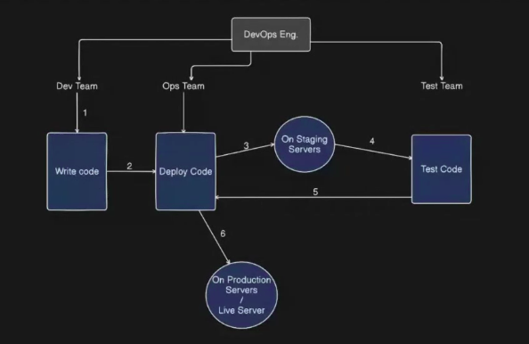

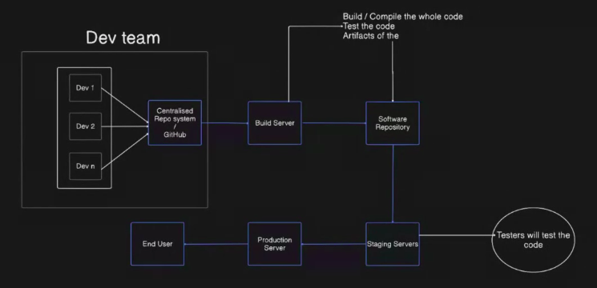

### DevOps Engineer
- Connects **Dev team, Test team, and Ops team**.
- Creates CI/CD pipelines for build, test, and deployment.
- Automates manual work using scripts, tools, and cloud services.
- Monitors application health after deployment.
- Helps fix deployment, server, and environment problems.

### Development Team
- Writes application code and pushes it to Git.
- Fixes bugs and adds new features.
- Works with DevOps to make code easy to build and deploy.

### Testing / QA Team
- Tests the application before release.
- Writes or runs automated test cases.
- Checks if new code breaks old features.
- Gives feedback before deployment.

### Operations Team
- Manages servers, networks, storage, and production systems.
- Handles uptime, backups, monitoring, and incidents.
- Works with DevOps to make production stable.

> Simple idea: **Dev builds, Test checks, Ops runs, DevOps connects and automates everything.**

---

## CI, CD, and Continuous Deployment

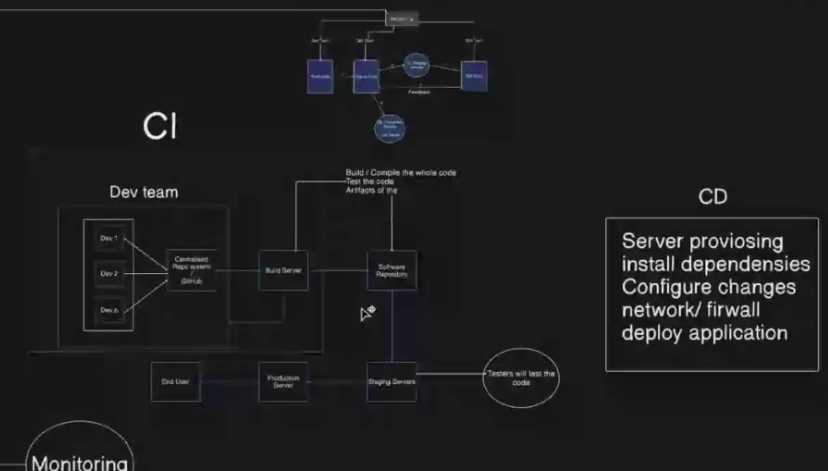

| Term | Simple meaning |
|------|----------------|
| **CI - Continuous Integration** | Developers push code often. The system automatically builds and tests the code. |
| **CD - Continuous Delivery** | Code is ready to deploy after build and test. Usually one manual approval is needed. |
| **Continuous Deployment** | Code automatically goes to production if all tests pass. No manual approval is needed. |

### Easy Difference
- **CI** = build + test automatically.
- **Continuous Delivery** = ready for release automatically.
- **Continuous Deployment** = released to users automatically.

---

## Better DevOps Pipeline

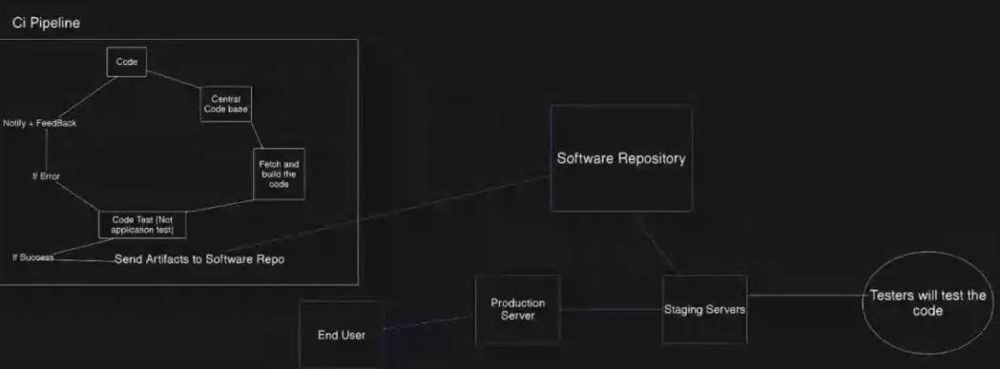

### Common Pipeline Steps
1. **Plan** - decide feature or bug fix.
2. **Code** - developer writes code.
3. **Commit** - code is pushed to Git.
4. **Build** - application package is created.
5. **Test** - automated tests run.
6. **Security Scan** - code and packages are checked for risk.
7. **Deploy** - application is released to staging or production.
8. **Monitor** - logs, metrics, and alerts are checked.

> A good pipeline reduces manual mistakes and gives fast feedback.

---

## Cloud Computing - Key Services

Cloud computing means using computing resources over the internet instead of buying and managing all hardware yourself.

### Main Service Models
| Service | Full form | Simple meaning | Example |
|---------|-----------|----------------|---------|
| **IaaS** | Infrastructure as a Service | Rent servers, storage, and networking. You manage OS and apps. | AWS EC2, Azure VM |
| **PaaS** | Platform as a Service | Provider manages server and runtime. You deploy your code. | Heroku, Google App Engine |
| **SaaS** | Software as a Service | Ready-made software used through browser/app. | Gmail, Google Drive, Salesforce |

---

## On-Premises vs Cloud

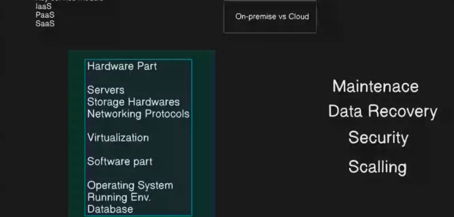

### On-Premises
On-premises means the company owns and manages its own servers in its own data center or office.

**Company is responsible for:**
- **Maintenance** - repairing and updating hardware/software.
- **Data recovery** - backups and disaster recovery setup.
- **Security** - physical security, firewall, access control.
- **Scaling** - buying and adding more servers when demand increases.

### Hardware Part
- Servers
- Storage hardware
- Network devices
- Physical data center space

### Software Part
- Operating system
- Database
- Runtime environment
- Application software

### Cloud
Cloud is mostly the opposite of on-premises:
- No need to buy physical servers.
- Cloud provider manages data centers and hardware.
- Easy to scale up or down.
- Pay only for what you use.
- Faster setup compared to traditional infrastructure.

---

## Virtualization and Hypervisor

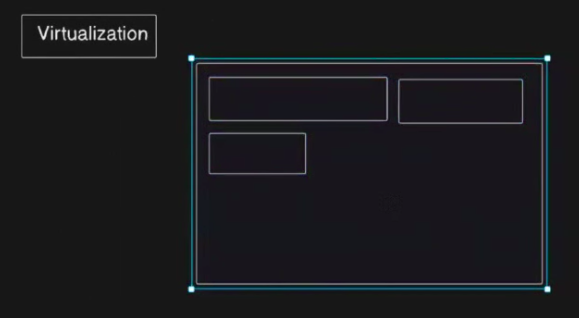

### Virtualization
Virtualization means creating multiple **virtual machines** from one physical machine.

### Hypervisor
A hypervisor is software that creates and manages virtual machines.

**Example:**
One physical server can run:
- VM 1 - Linux server
- VM 2 - Windows server
- VM 3 - Database server

> Simple idea: **Virtualization helps use one physical server like many separate servers.**

---

## On-Premises Infrastructure

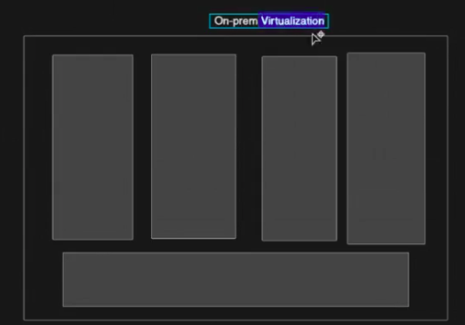

In on-premises infrastructure, the company controls almost everything:
- Physical building or server room.
- Servers and storage.
- Network and firewall.
- Operating systems.
- Databases.
- Application environment.
- Backup and recovery.

This gives more control, but it also needs more money, maintenance, and skilled staff.

---

## IaaS, PaaS, SaaS Responsibility

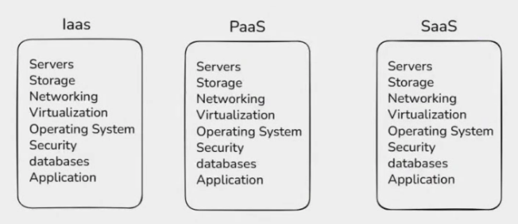

| Layer | On-Premises | IaaS | PaaS | SaaS |
|-------|-------------|------|------|------|
| Application | You manage | You manage | You manage | Provider manages |
| Data | You manage | You manage | You manage | Provider manages |
| Runtime | You manage | You manage | Provider manages | Provider manages |
| OS | You manage | You manage | Provider manages | Provider manages |
| Virtualization | You manage | Provider manages | Provider manages | Provider manages |
| Servers | You manage | Provider manages | Provider manages | Provider manages |
| Storage | You manage | Provider manages | Provider manages | Provider manages |
| Networking | You manage | Provider manages | Provider manages | Provider manages |

### Simple Memory Trick
- **IaaS** = provider gives infrastructure.
- **PaaS** = provider gives platform.
- **SaaS** = provider gives complete software.

---

## Why Linux is Important in Cloud

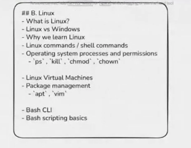

Linux is used heavily in cloud computing because it is stable, secure, flexible, and easy to automate.

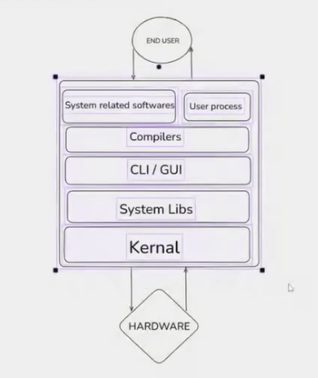

### Why Cloud Providers Use Linux
- **Open source** - companies can modify it for their own cloud systems.
- **Stable** - good for running servers 24/7.
- **Secure** - strong permission system and regular security updates.
- **Lightweight** - can run with fewer resources than many desktop operating systems.
- **Automation friendly** - works well with shell scripts, SSH, DevOps tools, and containers.
- **Best for servers** - most web servers, databases, and containers run on Linux.

> Simple idea: **Linux is the main server operating system used in cloud and DevOps.**

---

## Cloud Providers and Operating Systems

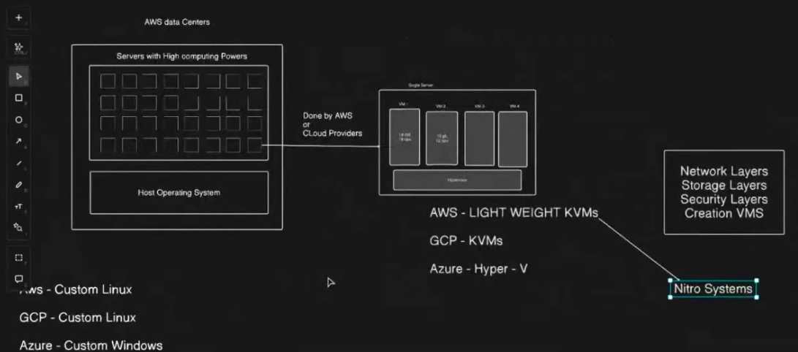

Different cloud providers use customized operating systems and virtualization technology internally.

| Cloud provider | Common virtualization base | Simple note |
|----------------|----------------------------|-------------|
| **AWS** | KVM-based virtualization with Nitro System | Uses lightweight virtualization and special hardware cards for better speed and security. |
| **Google Cloud / GCP** | KVM-based virtualization | Uses Linux/KVM technology for running virtual machines. |
| **Microsoft Azure** | Hyper-V based virtualization | Uses Microsoft Hyper-V technology, connected with Windows and Linux VM support. |

### Important Note
- AWS and Google use a lot of **custom Linux-based systems** inside their cloud.
- Azure is Microsoft cloud, so it uses **custom Windows/Hyper-V technology**, but it also runs Linux VMs very well.

---

## What Hypervisor Does

A **hypervisor** is the virtualization layer that creates and manages virtual machines.

### Main Work of Hypervisor
- **Create VMs** - divides one physical server into multiple virtual servers.
- **CPU management** - gives CPU power to each VM.
- **Memory management** - assigns RAM to each VM.
- **Network layer** - connects VMs to virtual/private nets.
- **Storage layer** - connects VMs to virtual disks and cloud storage.
- **Security layer** - isolates one VM from another VM.
- **Resource control** - prevents one VM from using all server resources.

> Simple idea: **Hypervisor sits between hardware and virtual machines.**

---

## AWS Nitro System

AWS Nitro System is AWS's modern virtualization system used for EC2 instances.

### Why AWS Nitro is Important
- Moves many virtualization tasks to special hardware cards.
- Improves VM performance because the main server CPU has less overhead.
- Improves security by isolating customers better.
- Handles networking, storage, and monitoring more efficiently.
- Allows AWS to provide faster and more lightweight EC2 instances.

### Easy Explanation
In older virtualization, the hypervisor did many jobs directly on the server CPU.  
In AWS Nitro, special Nitro cards handle many jobs like:
- Networking
- Storage
- Security
- Monitoring

So EC2 instances become faster, safer, and closer to real physical machine performance.

---

## Type 1 and Type 2 Hypervisor

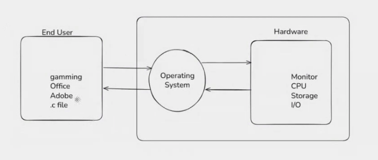

| Type | Also called | How it works | Example |
|------|-------------|--------------|---------|
| **Type 1 Hypervisor** | Bare-metal hypervisor | Runs directly on physical hardware. | VMware ESXi, Microsoft Hyper-V, KVM, Xen |
| **Type 2 Hypervisor** | Hosted hypervisor | Runs on top of an existing operating system. | VirtualBox, VMware Workstation |

### Type 1 Hypervisor
- Used in data centers and cloud platforms.
- Faster and more secure.
- Best for production servers.

### Type 2 Hypervisor
- Used mostly on laptops/desktops for practice and testing.
- Easy to install.
- Performance is lower because it depends on the host OS.

> Cloud providers mainly use **Type 1 hypervisors** because they need high performance and strong isolation.

---

## Linux Basics for Cloud and DevOps

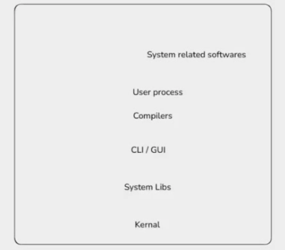

### Why DevOps Engineers Learn Linux
- Most cloud servers run Linux.
- Docker and Kubernetes are commonly used with Linux.
- CI/CD tools often run on Linux agents.
- Logs, services, permissions, and networking are managed using Linux commands.
- SSH is used to connect to remote Linux servers.

### Common Linux Skills
- File commands: `ls`, `cd`, `pwd`, `cp`, `mv`, `rm`
- Text commands: `cat`, `less`, `head`, `tail`, `grep`
- Permission commands: `chmod`, `chown`
- Process commands: `ps`, `top`, `kill`
- Service commands: `systemctl`, `journalctl`
- Network commands: `ping`, `curl`, `netstat`, `ss`

> Simple idea: **For DevOps, Linux is not optional. It is a daily tool.**

---

## Nested Virtualization

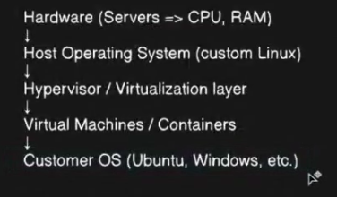

Nested virtualization means running a virtual machine **inside another virtual machine**.

### Simple Example
- Physical server runs a hypervisor.
- Hypervisor creates VM 1.
- Inside VM 1, we install another hypervisor.
- That inner hypervisor creates VM 2.

### Why Nested Virtualization is Used
- Practice cloud and virtualization concepts.
- Test hypervisors without buying physical servers.
- Run labs for DevOps, Kubernetes, OpenStack, and security testing.
- Create training environments inside cloud VMs.

### Important Point
Nested virtualization can be slower than normal virtualization because there are extra virtualization layers.

> Simple idea: **Nested virtualization = VM inside VM.**

---

## Why Cloud Providers Use Linux

Cloud providers use Linux because it is open source, stable, secure, and easy to customize.

### Main Reasons
- **Open source** - providers can modify Linux for their own cloud platform.
- **Low cost** - no license cost like many commercial operating systems.
- **Secure** - strong user permission and process isolation.
- **Stable** - good for servers running continuously.
- **Customizable** - easy to remove unnecessary parts and make it lightweight.
- **DevOps friendly** - works well with automation, shell scripting, containers, and CI/CD.

> AWS, Google Cloud, and many cloud services use heavily customized Linux-based systems internally.

---

## Basic Linux Commands

| Command | Use |
|---------|-----|
| `reboot` | Restart the machine. |
| `clear` | Clear the terminal screen. |
| `exit` | Exit from current shell/session. |
| `ip addr` | Show IP address and network interfaces. |
| `whoami` | Show current logged-in username. |
| `ls` | List files and folders. |
| `ls -l` | List files with more details like permissions, owner, size, and date. |
| `ls -lt` | List files sorted by latest modified first. |
| `ls -ltr` | List files sorted by oldest modified first. |

### Package Management Commands

| Command | Use |
|---------|-----|
| `sudo apt update` | Refresh package list from repositories. |
| `sudo apt upgrade` | Upgrade installed packages. |
| `sudo apt install python3` | Install Python 3. |
| `sudo apt remove python3` | Remove Python 3. |

### Important Difference
- `apt update` only updates the package list.
- `apt upgrade` upgrades the installed software.

---

## Sudo, Root User, and Normal User

### What is `sudo`?
`sudo` means **superuser do**. It allows a normal user to run commands with administrator/root permission.

### Root vs Normal User
| Symbol | Meaning |
|--------|---------|
| `$` | Normal user shell. |
| `#` | Root user shell. |

### Useful Commands
| Command | Use |
|---------|-----|
| `sudo -i` | Switch to root user shell. |
| `whoami` | Check which user you are currently using. |
| `exit` | Exit from root shell or SSH session. |

### Example
```bash
whoami
sudo -i
whoami
exit
```

> Use root carefully because root can change or delete important system files.

---

## SSH Basics

SSH means **Secure Shell**. It is used to connect to a remote Linux server securely.

### Why SSH is Used
- Login to cloud servers.
- Run Linux commands remotely.
- Manage EC2/VM instances.
- Copy files securely between machines.

### Install and Start SSH Server
```bash
sudo apt install openssh-server -y
sudo systemctl start ssh
sudo systemctl enable ssh
```

### Command Meaning
| Command | Use |
|---------|-----|
| `sudo apt install openssh-server -y` | Install SSH server. `-y` automatically answers yes during install. |
| `sudo systemctl start ssh` | Start SSH service now. |
| `sudo systemctl enable ssh` | Start SSH automatically after reboot. |

### Basic SSH Login Format
```bash
ssh username@server-ip
```

Example:
```bash
ssh ubuntu@192.168.1.10
```

> Simple idea: **SSH is the secure way to control Linux servers from another computer.**

---

## Linux Folder Structure

Linux file system starts from `/`, called the **root directory**. Everything in Linux is stored under `/`.

| Directory | Use |
|-----------|-----|
| `/` | Root directory. Starting point of the full Linux file system. |
| `/bin` | Essential user commands like `ls`, `cp`, `mv`, `cat`, `mkdir`. |
| `/sbin` | System administration commands like `reboot`, `shutdown`, `fdisk`. Mostly used by root/admin. |
| `/lib` | Important library files needed by commands and system programs. |
| `/etc` | Configuration files like users, groups, SSH config, network config. |
| `/home` | Home folders of normal users, like `/home/anuj`. |
| `/root` | Home folder of the root user. |
| `/var` | Variable data like logs, cache, mail, web files. Example: `/var/log`. |
| `/tmp` | Temporary files. Data here may be deleted automatically. |
| `/opt` | Optional third-party software installed manually. |
| `/usr` | User programs, libraries, documentation, and shared files. |
| `/dev` | Device files like disks, terminals, USB devices. |
| `/proc` | Virtual files showing running process and kernel information. |
| `/sys` | Virtual files showing hardware and kernel device information. |

> Note: You wrote `/str`, but the common important directory is usually `/usr`.

---

## User Management in Linux

Linux is a multi-user operating system. Many users can exist on the same server, and each user can have different permissions.

### Important User Files

| File | Use |
|------|-----|
| `/etc/passwd` | Stores user account information like username, UID, GID, home directory, and shell. |
| `/etc/shadow` | Stores encrypted password hashes and password aging information. Only root can read it. |
| `/etc/group` | Stores group information and group members. |

### View User and Group Files
```bash
cat /etc/passwd
cat /etc/shadow
cat /etc/group
```

---

## `useradd` vs `adduser`

| Command | Simple meaning |
|---------|----------------|
| `useradd` | Low-level command. Good for scripting. On many systems it does not create home folder unless `-m` is used. |
| `adduser` | Friendlier wrapper around `useradd` on Ubuntu/Debian. Usually asks questions and creates home folder by default. |

### Create User With `useradd`
```bash
sudo useradd -m -s /bin/bash username
```

| Option | Use |
|--------|-----|
| `-m` | Create user's home directory. |
| `-s /bin/bash` | Set login shell to Bash. |

### Create User With `adduser`
```bash
sudo adduser username
```

This usually creates:
- User account
- Home directory
- Default shell
- Password prompt

---

## Login as Another User

```bash
su - username
```

or with sudo:

```bash
sudo su - username
```

To check current user:
```bash
whoami
```

---

## `/etc/shadow` and Passwords

Linux does not store normal readable passwords. It stores **password hashes** in `/etc/shadow`.

### Important Points
- Passwords are encrypted/hashed, so they cannot be read directly.
- If password field shows `!` or `*`, password login is locked or no password is set.
- If you forget a Linux user password, root/admin can reset it using `passwd username`.
- If root access is lost, recovery is harder and may need rescue mode, boot disk, or cloud provider recovery tools.

### Reset User Password
```bash
sudo passwd username
```

### Cloud Note
Cloud providers usually do **not** store your VM password in plain text. For IaaS VMs, access is commonly done by:
- SSH key pair
- Password reset agent/extension
- Serial console or rescue mode
- Detaching disk and fixing access from another VM

---

## Delete User

Delete user and remove home directory:

```bash
sudo deluser --remove-home username
```

Only delete a user when you are sure their files are not needed.

---

## Group Management

Groups are used to give permissions to many users together.

### Create Group
```bash
sudo groupadd devteam
```

### View Groups
```bash
cat /etc/group
```

### Add User to Group
```bash
sudo usermod -aG devteam username
```

| Option | Use |
|--------|-----|
| `-a` | Append user to group without removing old groups. |
| `-G` | Add user to secondary group list. |

> Always use `-aG` together. If you use only `-G`, the user may be removed from other groups.

---

## `sudo` Group

In Ubuntu/Debian, `sudo` is also a group. Users in the `sudo` group can run admin commands with `sudo`.

### Add User to `sudo` Group
```bash
sudo usermod -aG sudo username
```

### Remove User From Group
```bash
sudo deluser username groupname
```

### Check User Groups
```bash
groups username
```

> Simple idea: **Users identify people/accounts, groups give shared permissions.**

---

## User Group Commands Explained

### Replace User Groups
```bash
sudo usermod -G anuj,sudo anuj
```

This sets the secondary groups of user `anuj` to only:
- `anuj`
- `sudo`

Important: `-G` without `-a` replaces old secondary groups. If `anuj` was already in `devteam`, this command can remove `anuj` from `devteam`.

### Add User to Extra Group
```bash
sudo usermod -aG devteam anuj
```

This adds user `anuj` to the `devteam` group without removing old groups.

| Option | Meaning |
|--------|---------|
| `-a` | Append/add to existing groups. |
| `-G` | Secondary group list. |

> Best practice: use `-aG` when adding a user to a group.

### Remove User From Group
```bash
sudo gpasswd -d anuj devteam
```

This removes user `anuj` from the `devteam` group.

### Check User ID and Groups
```bash
id anuj
```

This shows:
- UID - user ID
- GID - primary group ID
- groups - all groups the user belongs to

Example output:
```bash
uid=1000(anuj) gid=1000(anuj) groups=1000(anuj),27(sudo),1002(devteam)
```

---

## Normal User Default Permissions

A normal Linux user has limited permissions.

### Normal User Usually Can
- Read many system files.
- Create/edit files inside their own home directory, like `/home/anuj`.
- Create temporary files inside `/tmp`.
- Run normal commands like `ls`, `cat`, `pwd`, `whoami`.

### Normal User Usually Cannot
- Edit system files inside `/etc`.
- Install or remove software.
- Create users or groups.
- Change files owned by other users.
- Modify protected directories like `/bin`, `/sbin`, `/lib`, `/usr`.

> Note: normal users do not have only `/tmp` access. They also have access to their own home directory.

---

## `ls -ltr` Command

```bash
ls -ltr
```

| Part | Meaning |
|------|---------|
| `ls` | List files and directories. |
| `-l` | Long listing format with permissions, owner, size, date. |
| `-t` | Sort by modified time. |
| `-r` | Reverse the order. |

So `ls -ltr` shows files in long format, sorted from oldest to newest.

---

## Linux Permission Format

Example:
```bash
drwxrwxrwx
```

This has 10 characters:

```text
d rwx rwx rwx
```

| Part | Meaning |
|------|---------|
| `d` | Type. `d` means directory. `-` means file. |
| First `rwx` | Owner permissions. |
| Second `rwx` | Group permissions. |
| Third `rwx` | Others/everyone permissions. |

### Permission Letters
| Letter | Meaning for file | Meaning for directory |
|--------|------------------|-----------------------|
| `r` | Read file content. | List directory content. |
| `w` | Modify file content. | Create/delete/rename files inside directory. |
| `x` | Execute file. | Enter/access directory using `cd`. |
| `-` | Permission not given. | Permission not given. |

### Examples
| Permission | Meaning |
|------------|---------|
| `-rw-r--r--` | Normal file. Owner can read/write. Group and others can only read. |
| `drwxr-xr-x` | Directory. Owner full access. Group/others can read and enter. |
| `drwx------` | Directory only owner can access. |
| `drwxrwxrwx` | Directory everyone can read/write/enter. Not safe for important folders. |

> You wrote `drex-rwx-rwx`; the usual format is `drwxrwxrwx`. It means directory with read, write, execute for owner, group, and others.


---

## AWS Basics

AWS means **Amazon Web Services**. It provides cloud services like servers, storage, databases, networking, and security.

### AWS EC2 Instance
EC2 means **Elastic Compute Cloud**.

An EC2 instance is a virtual server in AWS.

We use EC2 to:
- Run websites.
- Run applications.
- Practice Linux commands.
- Host backend servers.
- Install software like Apache, Nginx, Java, Node.js, Docker, etc.

### PEM and PPK File

| File | Use |
|------|-----|
| `.pem` | Private key file used from Linux/macOS terminal or Git Bash. |
| `.ppk` | PuTTY private key file used with PuTTY on Windows. |

### Important Point
- AWS gives a key pair when creating an EC2 instance.
- Private key is used to SSH login into EC2.
- Keep the key safe. If lost, normal SSH login becomes difficult.
- On Linux/macOS, key permission should be secure:

```bash
chmod 400 key-name.pem
```

### SSH Login to EC2

```bash
ssh -i key-name.pem ubuntu@public-ip
```

For Amazon Linux:

```bash
ssh -i key-name.pem ec2-user@public-ip
```

| Part | Meaning |
|------|---------|
| `ssh` | Connect to remote server. |
| `-i key-name.pem` | Use this private key file. |
| `ubuntu` | Default user for Ubuntu EC2. |
| `ec2-user` | Default user for Amazon Linux EC2. |
| `public-ip` | Public IP address of EC2 instance. |

---

## Install Apache on EC2 and Serve Website

Apache is a web server. It receives browser requests and sends website files as response.

### Ubuntu EC2 Commands

```bash
sudo apt update
sudo apt install apache2 -y
sudo systemctl start apache2
sudo systemctl enable apache2
sudo systemctl status apache2
```

### Amazon Linux EC2 Commands

```bash
sudo yum update -y
sudo yum install httpd -y
sudo systemctl start httpd
sudo systemctl enable httpd
sudo systemctl status httpd
```

### Open Website in Browser

```text
http://public-ip
```

Security group must allow **HTTP port 80** from internet.

---

## Why `/var/www/html`?

`/var/www/html` is the default document root for Apache on Ubuntu.

Document root means the folder from where Apache serves website files.

Example:
- File path on server: `/var/www/html/index.html`
- Browser URL: `http://public-ip/index.html`

### Why Files Stay After EC2 Restart

Files inside `/var/www/html` are stored on the EC2 disk volume, not in RAM.

So files remain after:
- EC2 stop/start.
- EC2 reboot.
- Apache restart.

Files may be lost only if:
- EC2 is terminated and root volume is deleted.
- You manually delete the files.
- Volume is detached or damaged.

---

## Deploy Static Website to EC2 From Your Machine

### Step 1: Connect to EC2

```bash
ssh -i key-name.pem ubuntu@public-ip
```

### Step 2: Install Apache

```bash
sudo apt update
sudo apt install apache2 -y
sudo systemctl start apache2
sudo systemctl enable apache2
```

### Step 3: Copy Website Files From Local Machine

Run this command from your own machine, not inside EC2:

```bash
scp -i key-name.pem -r ./website/* ubuntu@public-ip:/tmp/
```

### Step 4: Move Files to Apache Folder

Run inside EC2:

```bash
sudo cp -r /tmp/* /var/www/html/
```

### Step 5: Check Website

Open:

```text
http://public-ip
```

---

## Elastic IP Address

Elastic IP is a fixed public IPv4 address in AWS.

Normal EC2 public IP can change after stop/start. Elastic IP stays same until you release it.

### Why Use Elastic IP?
- Fixed IP for website/server.
- Useful for DNS records.
- Public IP does not change after EC2 restart.

### Common Actions

| Action | Meaning |
|--------|---------|
| Allocate Elastic IP | Create/get a new Elastic IP in AWS. |
| Associate Elastic IP | Attach Elastic IP to EC2 instance or network interface. |
| Disassociate Elastic IP | Remove Elastic IP from instance/network interface. |
| Release Elastic IP | Delete Elastic IP from your AWS account. |

### Associate Path
Elastic IP -> Actions -> Associate Elastic IP address -> select instance/network interface.

### Disassociate Path
Elastic IP -> Actions -> Disassociate Elastic IP address.

> Note: AWS may charge for unused Elastic IP, so release it when not needed.

---

## AWS Volumes With EC2

EC2 uses EBS volumes for storage.

EBS means **Elastic Block Store**. It works like a virtual hard disk attached to EC2.

EBS is block storage. It is commonly used as the disk for EC2 instances.

### Important Points
- Root volume contains operating system files.
- Extra volumes can be attached for application data.
- Volumes are shown under EC2 -> Storage.
- If **Delete on termination** is enabled, volume is deleted when EC2 is terminated.
- If **Delete on termination** is disabled, volume remains even after EC2 termination.
- EBS volume and EC2 instance should be in the same Availability Zone.

> For important data, do not delete the volume when terminating EC2.

### EBS Volume Types

| EBS type | Simple use |
|----------|------------|
| General Purpose SSD | Normal applications, boot volume, websites. |
| Provisioned IOPS SSD | High I/O applications like large databases. |
| Throughput Optimized HDD | Big data, log processing, large sequential reads/writes. |
| Cold HDD | Low-cost storage for less frequently accessed data. |
| Magnetic | Older, low-cost previous generation storage. |

> Simple idea: **EBS is like a hard disk for EC2.**

---

## Types of Website

| Type | Meaning | Example |
|------|---------|---------|
| Static website | Same files are served to every user. No backend processing. | HTML, CSS, JS portfolio site. |
| Dynamic website | Server generates response using backend code/database. | Login app, ecommerce, dashboard. |

### Static Website
- Uses HTML, CSS, JavaScript.
- Easy to host on Apache, Nginx, or S3.
- Usually does not need write permission for Apache.

### Dynamic Website
- Uses backend like PHP, Node.js, Python, Java, etc.
- May connect to database.
- May need write permission for upload/cache/session folders.

---

## Apache Process Commands

### Show All Running Processes

```bash
ps -ef
```

### Search Apache Process

Ubuntu:

```bash
ps -ef | grep apache
```

Amazon Linux:

```bash
ps -ef | grep httpd
```

### Meaning
`ps -ef` shows running processes with details like user, process ID, parent process ID, and command.

---

## What is `www-data`?

`www-data` is the default Apache user/group on Ubuntu.

Apache worker processes run as `www-data` for security.

### Why Not Run Apache as Root?
- Root has full system permission.
- If website has a security issue, attacker can get more control.
- Running as `www-data` limits damage.

### File Permission for `/var/www/html`

For a simple static website:

```bash
sudo chown -R root:root /var/www/html
sudo chmod -R 755 /var/www/html
```

For a dynamic website where Apache needs write permission:

```bash
sudo chown -R www-data:www-data /var/www/html
```

Better practice: give write permission only to required folders, like uploads/cache, not the full website.

Example:

```bash
sudo chown -R www-data:www-data /var/www/html/uploads
```

---

## Useful Copy and Delete Commands

### Copy All Files and Folders

```bash
cp -r /from/* /to/
```

| Part | Meaning |
|------|---------|
| `cp` | Copy. |
| `-r` | Recursive, used for folders also. |
| `/from/*` | Copy everything inside source folder. |
| `/to/` | Destination folder. |

### Delete File or Folder Forcefully

```bash
rm -rf /location
```

| Option | Meaning |
|--------|---------|
| `-r` | Recursive, delete folders and their content. |
| `-f` | Force, do not ask confirmation. |

> Be very careful with `rm -rf`. A wrong path can delete important data.

---

## Authentication and Authorization

### Authentication
Authentication means **checking who you are**.

Example:
- Username and password login.
- SSH key login.
- OTP verification.

### Authorization
Authorization means **checking what you are allowed to do**.

Example:
- User can read files but cannot delete files.
- IAM user can start EC2 but cannot terminate EC2.
- Developer can deploy to staging but not production.

### Easy Difference

| Term | Simple question |
|------|-----------------|
| Authentication | Who are you? |
| Authorization | What can you access? |

---

## AWS IAM

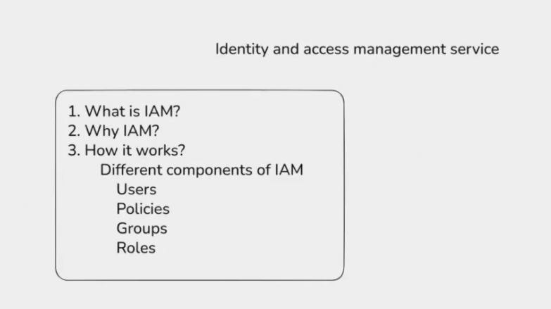

IAM means **Identity and Access Management**.

IAM is used to manage users, groups, roles, and permissions in AWS.

### IAM Main Parts

| Part | Meaning |
|------|---------|
| User | One person or application account. |
| Group | Collection of users with same permissions. |
| Role | Temporary permission given to AWS service or user. |
| Policy | JSON document that defines allowed or denied actions. |

### Example
- IAM user logs in to AWS.
- IAM policy allows `ec2:StartInstances`.
- Same policy may deny `ec2:TerminateInstances`.

> Simple idea: **IAM controls who can access AWS and what actions they can perform.**

---

## IAM User, Group, Policy, and Role

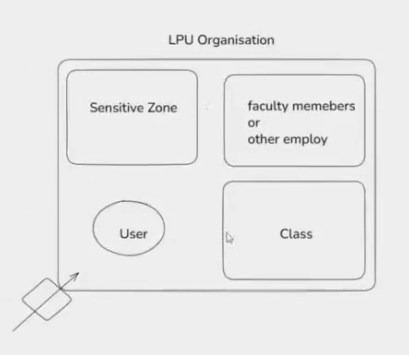
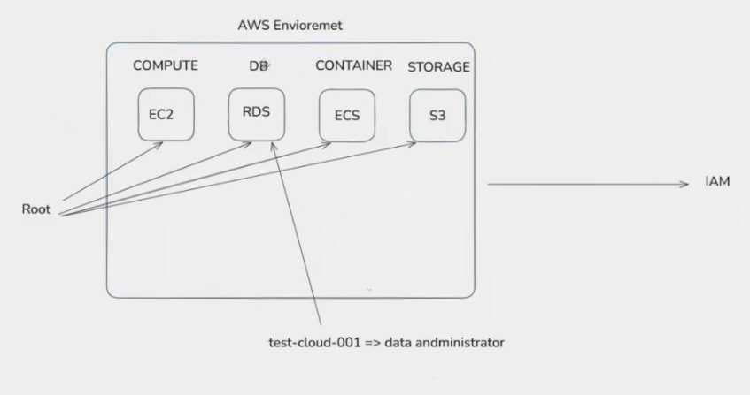
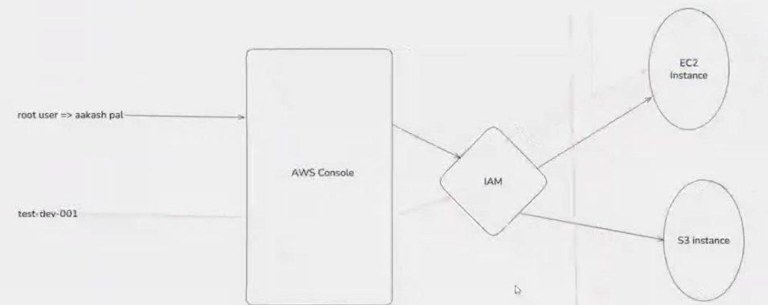

### IAM User With No Permission

An IAM user with no permission can only login to AWS console.

By default, the user cannot:
- Create EC2 instance.
- Start or stop EC2.
- Create S3 bucket.
- Read or delete AWS resources.

To give permission, we attach a policy directly to the user or add the user to a group that already has permission.

### IAM Group

IAM group is a collection of IAM users.

Example:
- `Developers` group can access EC2.
- `Admins` group can access all AWS services.
- `ReadOnly` group can only view resources.

If a user is added to a group, the user gets the group's permissions.

### IAM Policy

IAM policy is a JSON document that defines permissions.

Policy tells:
- Which service is allowed.
- Which action is allowed or denied.
- Which resource can be accessed.

Example actions:
- `ec2:StartInstances`
- `ec2:StopInstances`
- `s3:GetObject`
- `s3:PutObject`

---

## AWS IAM Roles in Depth

IAM role is an identity with permissions, but it is not a normal user.

A role is used to give **temporary access**.

### Where Roles Are Used

Roles are commonly used:
- Between two AWS services.
- By an AWS service to access another AWS service.
- By users for temporary access.
- By applications running inside EC2.

### Example: EC2 Role

Suppose an application is running on EC2 and needs to read files from S3.

Bad method:
- Store AWS access key and secret key inside EC2.

Good method:
- Create IAM role with S3 read permission.
- Attach role to EC2.
- EC2 gets temporary credentials automatically.

### Why Roles Are Better

- No need to store permanent access keys.
- Temporary credentials are rotated automatically.
- More secure for AWS services.
- Easy to give and remove permission.

### Role Trust Policy and Permission Policy

IAM role has two important parts:

| Part | Meaning |
|------|---------|
| Trust policy | Who can use/assume this role? |
| Permission policy | What can this role do after it is assumed? |

Example:
- Trust policy says EC2 can assume this role.
- Permission policy says role can read S3 bucket.

### Simple Role Flow

```text
EC2 instance -> assumes IAM role -> gets temporary credentials -> accesses S3
```

> Simple idea: **User is for a person/application login. Role is for temporary permission, often used between AWS services.**

---

## EC2 Basics

EC2 means **Elastic Compute Cloud**.

An EC2 instance is a virtual machine/server in AWS.

EC2 provides:
- CPU
- RAM
- Network
- Storage
- Operating system

### Pay As You Go Model

AWS follows a pay as you go model.

This means:
- You pay only for what you use.
- If EC2 runs for more time, cost increases.
- If EC2 is stopped, compute cost usually stops.
- Storage cost can continue even if EC2 is stopped.

> Important: Stop or terminate unused EC2 instances to avoid extra cost.

---

## EC2 Instance Types

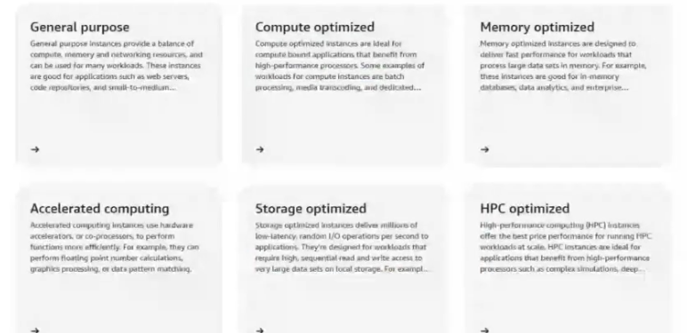

EC2 instance type decides the CPU, RAM, storage, and network capacity of the instance.

### Common EC2 Instance Type Families

| Type | Best for | Simple meaning |
|------|----------|----------------|
| General purpose | Web servers, small apps, testing | Balanced CPU, RAM, and network. |
| Compute optimized | Gaming servers, batch jobs, CPU-heavy apps | More CPU power. |
| Memory optimized | Databases, caching, big data | More RAM. |
| Storage optimized | Large file processing, high disk usage | Faster/local storage. |
| Accelerated computing | ML, AI, graphics, GPU workloads | Uses GPU or special hardware. |

### Example Instance Names

| Example | Meaning |
|---------|---------|
| `t2.micro` | General purpose, small, often used for practice/free tier. |
| `t3.micro` | Newer general purpose small instance. |
| `m5.large` | General purpose production-type instance. |
| `c5.large` | Compute optimized instance. |
| `r5.large` | Memory optimized instance. |

### How to Read `t2.micro`

| Part | Meaning |
|------|---------|
| `t` | Instance family. |
| `2` | Generation/version. |
| `micro` | Size of instance. |

Size can be:
- `nano`
- `micro`
- `small`
- `medium`
- `large`
- `xlarge`

Larger size means more CPU/RAM and higher cost.

---

## Network Fundamentals

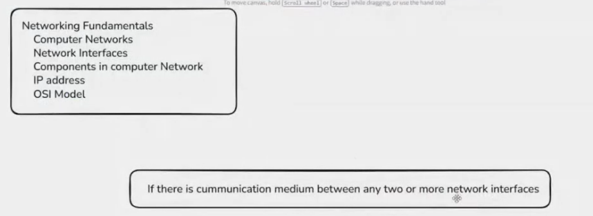

### Computer Network

A computer network is a group of devices connected together to share data and resources.

Examples:
- Laptop connected to Wi-Fi.
- Mobile connected to internet.
- EC2 instances connected inside AWS VPC.
- Office computers connected through LAN.

### Why Networking Is Important in Cloud

Cloud servers need networking to:
- Connect to internet.
- Communicate with other servers.
- Connect frontend, backend, and database.
- Control access using security groups and firewalls.

---

## Network Interface

A network interface is the connection point between a computer/server and the network.

In physical computers, it can be:
- Ethernet card.
- Wi-Fi adapter.

In AWS, EC2 uses **Elastic Network Interface**, also called ENI.

ENI contains:
- Private IP address.
- Public IP address if assigned.
- Security groups.
- MAC address.

> Simple idea: **Network interface is like the network card of a server.**

---

## Components in Computer Network

| Component | Simple meaning |
|-----------|----------------|
| Device/Host | Computer, server, mobile, printer, EC2 instance. |
| NIC | Network Interface Card used to connect to network. |
| Switch | Connects devices inside the same local network. |
| Router | Connects different networks together. |
| Modem | Connects home/office network to ISP. |
| Firewall | Allows or blocks traffic based on rules. |
| IP address | Unique address of a device in network. |
| DNS | Converts domain name to IP address. |

---

## IP Address

IP address is a unique address used to identify a device on a network.

Example:

```text
192.168.1.10
```

### Types of IP Address

| Type | Meaning |
|------|---------|
| Private IP | Used inside private/local network. |
| Public IP | Used on internet. |
| Static IP | Fixed IP address. |
| Dynamic IP | IP address that can change. |

### AWS Example

| IP type | Use |
|---------|-----|
| Private IP | EC2 communication inside VPC. |
| Public IP | Connect to EC2 from internet. |
| Elastic IP | Fixed public IP for EC2. |

---

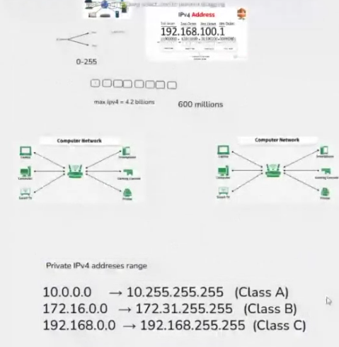
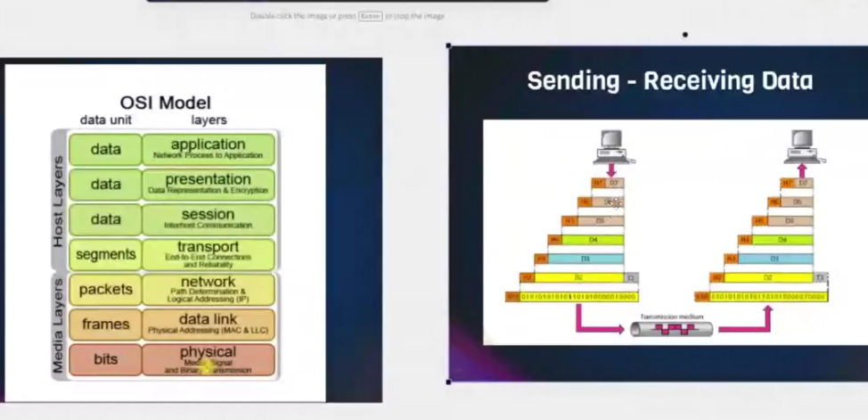
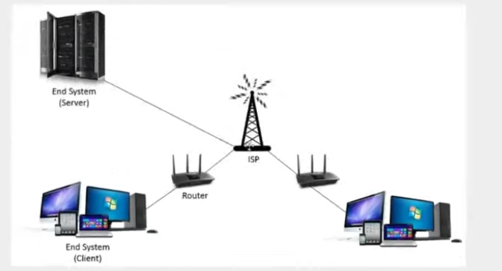


## OSI Model

OSI model explains how data travels from one computer to another.

It has 7 layers.

| Layer | Name | Simple meaning |
|-------|------|----------------|
| 7 | Application | User-facing apps like browser, HTTP, DNS. |
| 6 | Presentation | Data format, encryption, compression. |
| 5 | Session | Starts and manages communication session. |
| 4 | Transport | Reliable data transfer, TCP/UDP, ports. |
| 3 | Network | IP address and routing. |
| 2 | Data Link | MAC address and local network transfer. |
| 1 | Physical | Cables, signals, Wi-Fi, hardware. |

### Easy Flow

```text
Browser -> HTTP -> TCP -> IP -> Network card -> Cable/Wi-Fi
```

> Simple idea: **OSI model is a layered way to understand networking.**


---

## Traceroute, Public IP, Private IP, and NAT

### Trace Command for Website Request

Traceroute shows the path your request takes to reach a website/server.

For Google:

```bash
traceroute google.com
```

On Windows:

```cmd
tracert google.com
```

If `traceroute` is not installed on Ubuntu:

```bash
sudo apt install traceroute -y
```

### What Traceroute Shows

Traceroute shows routers/hops between your machine and destination.

Example:

```text
Your laptop -> home router -> ISP router -> internet routers -> Google server
```

Each line is usually one router/hop.

Some hops may show `* * *`. This means that router is not replying to traceroute, but traffic may still pass through it.

---

## How a Request to `google.com` Is Served

When you open `google.com`:

1. Browser asks DNS: what is the IP of `google.com`?
2. DNS returns an IP address.
3. Your laptop sends request to your router.
4. Router sends request to ISP.
5. ISP sends request through internet routers.
6. Request reaches Google server/load balancer.
7. Google sends response back.
8. Browser shows the website.

Simple flow:

```text
Browser -> DNS -> Router -> ISP -> Internet -> Google -> Response back
```

---

## How to Check Your IP

### Check Private IP on Your Machine

Linux:

```bash
ip addr
```

Windows:

```cmd
ipconfig
```

Private IP examples:

```text
192.168.1.10
10.0.0.5
172.16.5.20
```

### Check Public IP Seen by Internet

```bash
curl ifconfig.me
```

Or open a website like:

```text
whatismyipaddress.com
```

This shows your **public IP**, not your laptop's private IP.

---

## IPv4 Address Limit and Private IP

IPv4 has about **4.3 billion** total addresses.

But not all are usable for normal public internet because some are reserved for:
- Private networks.
- Loopback.
- Multicast.
- Testing/documentation.
- Special networking use.

Because public IPv4 addresses are limited, private IP ranges are used inside local networks.

### Private IPv4 Ranges

| Range | Common use |
|-------|------------|
| `10.0.0.0/8` | Large private networks. |
| `172.16.0.0/12` | Medium/private networks. |
| `192.168.0.0/16` | Home/office networks. |

These private IPs are not routed on the public internet.

---

## Why Same Private IP Can Exist in Many Homes

Many routers give private IPs to devices.

Example:
- Your laptop: `192.168.1.10`
- Your friend's laptop: `192.168.1.10`
- Another office laptop: `192.168.1.10`

This is allowed because private IPs are used only inside each local network.

They do not need to be globally unique.

Public IP must be unique on the internet.  
Private IP only needs to be unique inside the same local network.

---

## What IP Does a Website See?

When you check your IP from a website, the website sees your **public IP**.

It usually does not see your laptop's private IP.

Example:

```text
Laptop private IP: 192.168.1.10
Router public IP: 49.x.x.x
Website sees: 49.x.x.x
```

This happens because of NAT.

---

## NAT - Network Address Translation

NAT allows many private devices to use one public IP.

Example:

```text
Laptop      192.168.1.10
Mobile      192.168.1.11
TV          192.168.1.12
Router      Public IP: 49.x.x.x
```

All devices go to internet using router's public IP.

Router keeps a NAT table to remember which response belongs to which device.

### NAT Example

```text
Laptop sends request to google.com
Source IP changes from 192.168.1.10 to router public IP 49.x.x.x
Google replies to 49.x.x.x
Router receives reply
Router forwards reply back to 192.168.1.10
```

> Simple idea: **Private IP is used inside home/office. Public IP is used on internet. NAT connects both worlds.**

---

## Can Router Have Private IP?

Yes, a router usually has at least two sides:

| Router side | IP type | Example |
|-------------|---------|---------|
| LAN side | Private IP | `192.168.1.1` |
| WAN side | Public or private IP | `49.x.x.x` or `100.64.x.x` |

### Home Router LAN IP

Your router's inside/local IP is usually private.

Example:

```text
192.168.1.1
```

Your laptop uses this as the default gateway.

### Router WAN IP

The router's outside/WAN IP can be:
- Public IP given by ISP.
- Private/shared IP if ISP uses CGNAT.

---

## What If Router WAN IP Is Also Private?

Sometimes your router does not get a public IP directly.

ISP may give your router a private/shared IP and use another NAT at ISP level.

This is called **CGNAT** or **Carrier Grade NAT**.

Flow:

```text
Laptop private IP -> home router private/shared WAN IP -> ISP public IP -> internet
```

In this case, websites see the ISP's public IP, not your router's private WAN IP.

### How Will World See It?

The world/internet only sees the final public IP used by NAT.

If you are behind normal NAT:

```text
Website sees your router public IP.
```

If you are behind CGNAT:

```text
Website sees ISP public IP shared by many customers.
```

> Simple answer: **The world cannot directly see private IPs. It sees a public IP after NAT.**


---

## Subnet, Subnetting, and Subnetwork

A subnet or subnetwork is a smaller network created from a bigger network.

Subnetting means dividing one large network into smaller parts.

### Why Subnetting Is Used

- To organize network properly.
- To separate public and private resources.
- To improve security.
- To reduce unnecessary network traffic.
- To manage IP addresses better.

### Simple Example

Big network:

```text
10.0.0.0/16
```

Can be divided into smaller subnets:

```text
10.0.1.0/24
10.0.2.0/24
10.0.3.0/24
```

Example use:
- `10.0.1.0/24` = public subnet
- `10.0.2.0/24` = private app subnet
- `10.0.3.0/24` = private database subnet

> Simple idea: **Subnetting divides a big network into smaller networks.**

---

## CIDR

CIDR means **Classless Inter-Domain Routing**.

CIDR is a way to write IP address ranges.

Example:

```text
192.168.1.0/24
```

Here:
- `192.168.1.0` is the network address.
- `/24` tells how many bits are fixed for the network.

### Common CIDR Examples

| CIDR | Approx IP count | Simple use |
|------|-----------------|------------|
| `/16` | 65,536 IPs | Large network/VPC. |
| `/24` | 256 IPs | Common subnet size. |
| `/28` | 16 IPs | Small subnet. |
| `/32` | 1 IP | Single IP address. |

### Important Point

Smaller CIDR number means bigger network.

Example:
- `/16` has more IPs than `/24`.
- `/24` has more IPs than `/28`.

---

## DNS Resolution

DNS means **Domain Name System**.

DNS converts domain name into IP address.

Example:

```text
google.com -> 142.250.x.x
```

### DNS Resolution Flow

When you open `google.com`:

1. Browser checks its cache.
2. Operating system checks DNS cache.
3. Request goes to DNS resolver, usually ISP or public DNS like Google DNS.
4. Resolver asks root DNS server.
5. Root server points to `.com` DNS server.
6. `.com` server points to Google's DNS server.
7. Google's DNS server returns IP address.
8. Browser connects to that IP.

Simple flow:

```text
Domain name -> DNS lookup -> IP address -> website request
```

---

## OSI Model and TCP/IP Layers

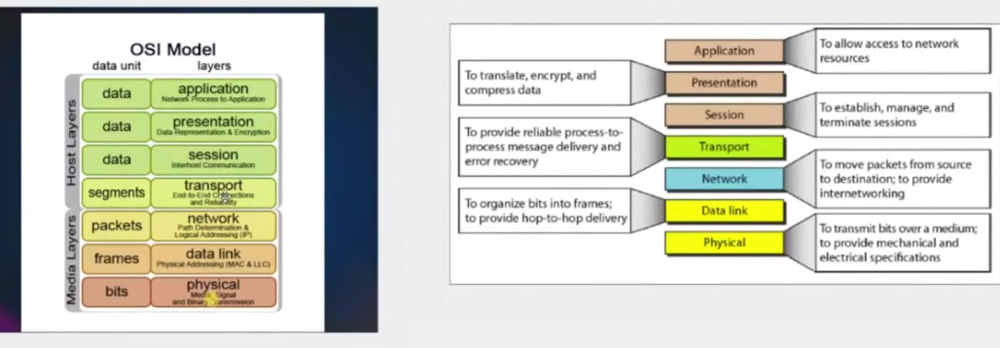
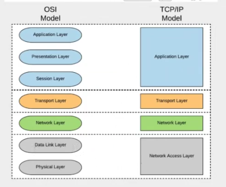

OSI model has 7 layers. TCP/IP model is the practical model used on the internet.

### OSI vs TCP/IP

| OSI Layer | TCP/IP Layer | Example |
|-----------|--------------|---------|
| Application, Presentation, Session | Application | HTTP, DNS, SSH, FTP |
| Transport | Transport | TCP, UDP |
| Network | Internet | IP, routing |
| Data Link, Physical | Network Access | Ethernet, Wi-Fi, cables |

### Simple Request Flow

When opening a website:

```text
HTTP request -> TCP port 443 -> IP address -> Ethernet/Wi-Fi -> internet
```

### Common Protocols

| Protocol | Layer | Use |
|----------|-------|-----|
| HTTP/HTTPS | Application | Website access. |
| DNS | Application | Domain to IP conversion. |
| SSH | Application | Remote server login. |
| TCP | Transport | Reliable connection. |
| UDP | Transport | Fast connection, no guarantee. |
| IP | Internet/Network | Addressing and routing. |

---

## Virtual Private Cloud - VPC

A VPC means **Virtual Private Cloud**.

It is your private network inside AWS.

Inside a VPC, you can create:
- Subnets.
- EC2 instances.
- Route tables.
- Internet gateway.
- NAT gateway.
- Security groups.
- NACLs.
- Load balancers.

Example VPC CIDR:

```text
10.0.0.0/16
```

> Simple idea: **VPC is like your own private data center network inside AWS.**

---

## Public Gateway / Internet Gateway

In AWS, the correct name is usually **Internet Gateway**, not public gateway.

An Internet Gateway allows resources in a VPC to connect to the internet.

For an EC2 instance to be public:
- It must be in a public subnet.
- It must have a public IP or Elastic IP.
- Route table must have route to Internet Gateway.
- Security group must allow required traffic.

Route table example:

```text
0.0.0.0/0 -> Internet Gateway
```

`0.0.0.0/0` means all IPv4 internet traffic.

---

## Public Subnet and Private Subnet

### Public Subnet

A public subnet is a subnet that has a route to Internet Gateway.

Used for:
- Public web servers.
- Load balancers.
- Bastion host.

### Private Subnet

A private subnet does not have a direct route to Internet Gateway.

Used for:
- Databases.
- Backend app servers.
- Internal services.

### Difference

| Subnet type | Internet route | Common resources |
|-------------|----------------|------------------|
| Public subnet | Has route to Internet Gateway | Load balancer, public EC2 |
| Private subnet | No direct route to Internet Gateway | Database, backend EC2 |

> Simple idea: **Public subnet can be reached from internet if rules allow. Private subnet is kept internal.**

---

## Load Balancer

A load balancer distributes traffic across multiple servers.

Example:

```text
Users -> Load Balancer -> EC2-1 / EC2-2 / EC2-3
```

### Why Load Balancer Is Used

- Handles more traffic.
- Improves availability.
- Sends traffic only to healthy instances.
- Helps avoid single server failure.
- Can handle HTTPS certificates.

### AWS Common Load Balancers

| Type | Use |
|------|-----|
| Application Load Balancer | HTTP/HTTPS web traffic. |
| Network Load Balancer | Very fast TCP/UDP traffic. |
| Gateway Load Balancer | Security appliances/firewalls. |

---

## NACL and Security Group

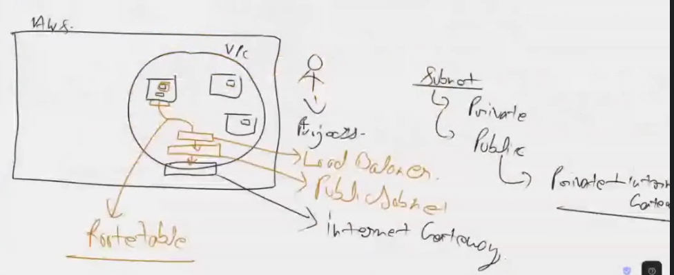


Both NACL and Security Group are used to control network traffic in AWS.

### Security Group

Security group works at EC2/network interface level.

Important points:
- Stateful.
- Rules are only allow rules.
- If inbound request is allowed, response is automatically allowed.
- Commonly attached to EC2, load balancer, RDS, etc.

Example:
- Allow HTTP port 80 from internet.
- Allow SSH port 22 only from your IP.

### NACL

NACL means **Network Access Control List**.

NACL works at subnet level.

Important points:
- Stateless.
- Has allow and deny rules.
- Inbound and outbound rules are checked separately.
- Applies to all resources inside that subnet.

### Security Group vs NACL

| Feature | Security Group | NACL |
|---------|----------------|------|
| Level | Instance/network interface | Subnet |
| State | Stateful | Stateless |
| Rules | Allow only | Allow and deny |
| Return traffic | Automatically allowed | Must be allowed separately |
| Common use | Instance level protection | Subnet level protection |

> Simple idea: **Security group protects instance. NACL protects subnet.**

---

## AWS VPC Application Architecture

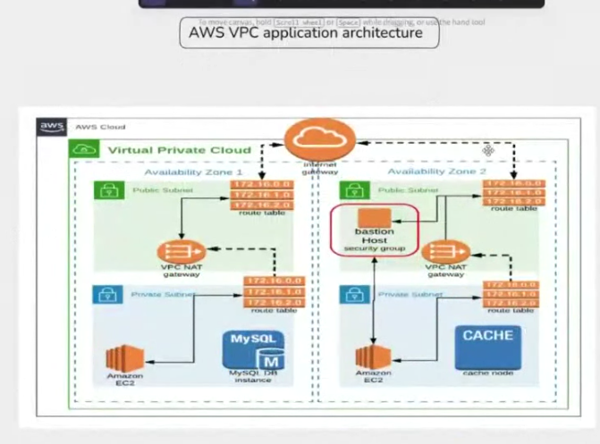

This architecture is used to deploy an application securely inside a VPC.

### Basic Design

- Create one VPC for the application.
- Create 4 subnets:
  - 2 public subnets.
  - 2 private subnets.
- Place subnets in 2 different Availability Zones.
- If one Availability Zone goes down, the application can still run from the other Availability Zone.

> Note: A subnet belongs to one Availability Zone. For multi-region deployment, create separate VPCs in different AWS regions.

### Internet Gateway

- Create an Internet Gateway.
- Attach the Internet Gateway to the VPC.
- Create or update the public route table.
- Add this route in the public route table:

```text
0.0.0.0/0 -> Internet Gateway
```

- Associate the public route table with public subnets.
- Resources in public subnets can connect to the internet if security group rules allow it.

### NAT Gateway

- NAT Gateway is created in a public subnet.
- Private subnets use NAT Gateway to access the internet.
- Private EC2 instances can download packages and updates from the internet.
- Internet users cannot directly connect to private EC2 instances through NAT Gateway.

Private subnet route table example:

```text
0.0.0.0/0 -> NAT Gateway
```

> Simple idea: **Internet Gateway is for public subnet internet access. NAT Gateway is for private subnet outbound internet access.**

---

## Bastion Host for Private EC2 Access

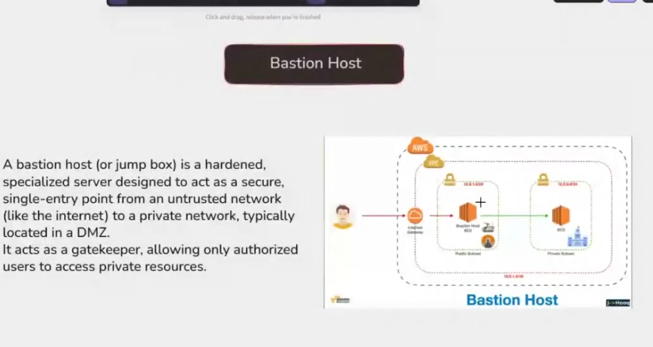

A bastion host is an EC2 instance in the public subnet.

It is used to connect to EC2 instances in private subnets.

### Bastion Host Setup

- Launch bastion host EC2 in public subnet.
- Give it a public IP or Elastic IP.
- Bastion security group should allow SSH only from your IP.
- Private EC2 security group should allow SSH only from bastion host security group.

Security group flow:

```text
Your laptop IP -> Bastion host -> Private EC2
```

### Copy PEM File to Bastion Host

For practice/lab, you can copy the private EC2 key to bastion host:

```bash
scp -i "test1.pem" "test1.pem" ubuntu@public-ip:/home/ubuntu
```

Then connect to bastion host:

```bash
ssh -i "test1.pem" ubuntu@public-ip
```

Inside bastion host, set permission and connect to private EC2:

```bash
chmod 400 test1.pem
ssh -i "test1.pem" ubuntu@private-ip
```

> Important: In real projects, avoid copying PEM/private keys to servers. Prefer SSH agent forwarding, Session Manager, or a secure access tool.

### Final Flow

```text
User -> Load Balancer -> App EC2 in private subnet
Admin -> Bastion Host -> Private EC2
Private EC2 -> NAT Gateway -> Internet
```

> Simple idea: **Public subnet exposes only required entry points like load balancer and bastion host. Application servers stay inside private subnets.**

---

## Storage Services in AWS

AWS provides different storage services for different types of data.

Main AWS storage services:
- **EBS** - block storage for EC2.
- **EFS** - file system storage shared by multiple servers.
- **S3** - object storage for files, backups, images, videos, and static websites.

---

## Types of Storage

### 1. Block Storage

Block storage stores data in fixed-size blocks.

It works like a hard disk or SSD attached to a server.

AWS example:
- **EBS - Elastic Block Store**

Used for:
- EC2 root volume.
- Database storage.
- Application data.

> Simple idea: **Block storage is like a disk attached to one EC2 instance.**

### 2. File System Based Storage

File storage stores data as files and folders.

Multiple servers can share the same file system.

AWS example:
- **EFS - Elastic File System**

Used for:
- Shared application files.
- Common upload folder.
- Multiple EC2 instances needing same files.

> Simple idea: **File storage is like a shared folder for many servers.**

### 3. Object Based Storage

Object storage stores data as objects inside buckets.

Each object contains:
- File/data.
- Metadata.
- Unique key/name.

AWS example:
- **S3 - Simple Storage Service**

Used for:
- Images and videos.
- Backups.
- Logs.
- Static website hosting.
- Large files.

> Simple idea: **Object storage is best for storing files, not for installing OS.**

---

## EBS - Elastic Block Store

EBS is the storage volume used with EC2.

When we create an EC2 instance, AWS creates a root EBS volume for the operating system.

We can also create extra EBS volumes and attach them to EC2.

### EBS Volume Types

| Type | Use |
|------|-----|
| General Purpose SSD | Normal use, boot volume, small/medium applications. |
| Provisioned IOPS SSD | High input/output apps like databases. |
| Throughput Optimized HDD | Big data, logs, large data processing. |
| Cold HDD | Low-cost storage for rarely accessed data. |
| Magnetic | Older and cheaper previous generation storage. |

### Create and Attach EBS Volume to EC2

Steps:
- Go to EC2 dashboard.
- Open **Elastic Block Store -> Volumes**.
- Create a new volume.
- Select size, type, and same Availability Zone as EC2.
- Attach the volume to EC2 instance.
- Connect to EC2 using SSH.
- Format the volume if it is new.
- Mount the volume to a folder.

### Mounting

Mounting means connecting a storage volume to a folder in Linux.

After mounting, we can read and write data through that folder.

Example idea:

```text
EBS volume -> mounted to /data -> application reads/writes files
```

> Simple idea: **Mounting is like creating a door between Linux folder and storage disk.**

### Disk and Mount Commands

Show all disks attached to the system:

```bash
sudo fdisk -l
```

Show mounted file systems and free space:

```bash
df -h
```

Show block devices in simple tree format:

```bash
lsblk
```

### Common File Systems

| File system | Common use |
|-------------|------------|
| NTFS | Windows disk. |
| FAT/FAT32/exFAT | Pen drive or cross-platform storage. |
| ext4 | Common Linux file system. |
| XFS | Linux file system, often used for large storage. |

### Create Partition

Use `fdisk` to create/manage partitions on a disk.

Example:

```bash
sudo fdisk /dev/nvme1n1
```

Inside `fdisk`, common keys:
- `n` - create new partition.
- `p` - print partition table.
- `w` - write changes and exit.
- `q` - quit without saving.

> Be careful: wrong disk selection can delete data.

### Format the Disk

Formatting creates a file system on the disk/partition.

Example for ext4:

```bash
sudo mkfs.ext4 /dev/nvme1n1
```

If a partition is created, format the partition name:

```bash
sudo mkfs.ext4 /dev/nvme1n1p1
```

> Note: Formatting deletes existing data on that disk/partition.

### Temporary Mount

Temporary mount works until reboot.

Create a folder:

```bash
sudo mkdir /data
```

Mount disk/partition to folder:

```bash
sudo mount /dev/nvme1n1 /data
```

Or if partition exists:

```bash
sudo mount /dev/nvme1n1p1 /data
```

Unmount:

```bash
sudo umount /data
```

### Permanent Mount

Permanent mount means disk automatically mounts after reboot.

Step 1: Get UUID of disk/partition:

```bash
sudo blkid
```

Example output idea:

```text
/dev/nvme1n1: UUID="abcd-1234" TYPE="ext4"
```

Step 2: Create mount folder:

```bash
sudo mkdir /data
```

Step 3: Edit `/etc/fstab`:

```bash
sudo nano /etc/fstab
```

Step 4: Add this line:

```text
UUID=abcd-1234 /data ext4 defaults,nofail 0 2
```

Step 5: Test mount:

```bash
sudo mount -a
```

Step 6: Check:

```bash
df -h
```

> Simple idea: **Temporary mount uses `mount` command. Permanent mount uses `/etc/fstab`.**

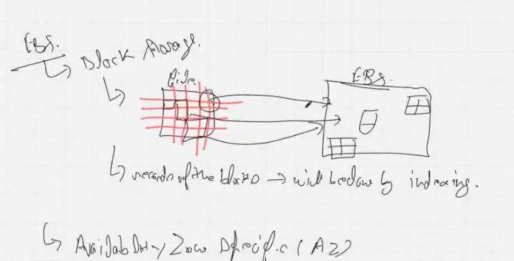

## S3 - Simple Storage Service

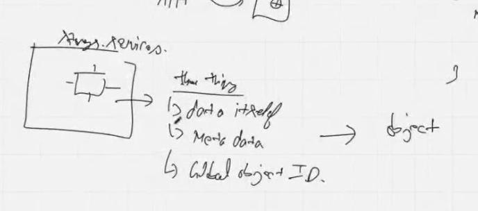
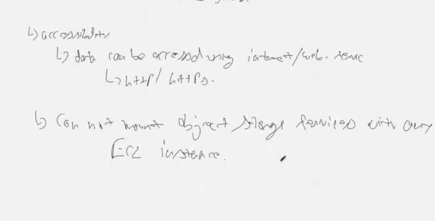

Amazon S3 is an **object storage service** used to store files, images, videos, backups, logs, and static website content.

S3 is managed by AWS, so we do not need to manage disks, partitions, mounting, or manual scaling.

> Simple idea: **S3 is like unlimited online storage for objects/files.**

### S3 Main Points

| Point | Short detail |
|------|--------------|
| Full form | Simple Storage Service |
| Storage type | Object storage |
| Scope | Region specific |
| Data design | Data is distributed across multiple Availability Zones in a Region, depending on storage class. |
| Scaling | Managed automatically by AWS. |
| Pricing | Pay for what you store and use. |
| Bucket rule | We can create many buckets, but we cannot create a bucket inside another bucket. |
| Access | Accessed using HTTP/HTTPS, AWS Console, AWS CLI, SDK, or API. |

### Bucket Structure

| Bucket part | Meaning |
|-------------|---------|
| Bucket name / bucket ID | Unique name of the bucket. |
| Object data | Actual file content, like image, video, backup, log, or document. |
| Object key | Unique object name/path inside the bucket. |
| Metadata | Extra information about the object, like content type, size, and custom tags. |

Example:

```text
bucket
{
  bucket name,
  objects/data,
  object keys,
  metadata
}
```

### S3 vs EBS

| Feature | S3 | EBS |
|---------|----|-----|
| Storage type | Object storage | Block storage |
| Scope | Region level service | Availability Zone level service |
| Used for | Files, images, videos, backups, logs, static websites | EC2 root volume, application disk, database disk |
| Attach/mount | Cannot be mounted as a normal EC2 disk | Can be attached and mounted to EC2 |
| Access method | HTTP/HTTPS, API, CLI, SDK | Linux file system after mounting |
| Scaling | Automatically managed by AWS | User selects and manages volume size/type |
| Cost idea | Pay for stored data and requests | Pay for provisioned volume size and type |

> Simple idea: **S3 is for storing objects. EBS is like a hard disk for EC2.**

### S3 Access vs EBS Access

| Topic | S3 | EBS |
|-------|----|-----|
| Access from application | Use S3 URL/API/SDK/CLI. | Read/write from mounted folder. |
| Website hosting | Easy for static websites. | Need EC2 web server like Apache or Nginx. |
| EC2 dependency | Does not need EC2. | Commonly attached to EC2. |
| Mounting | Not mounted like a normal disk. | Mounted to a Linux directory. |

### S3 Storage Classes / Types

| Storage class | Short detail | Availability design |
|---------------|--------------|---------------------|
| S3 Standard | Default class for frequently accessed data. | Stores data across minimum 3 Availability Zones. |
| S3 Standard-IA | Infrequent Access; for data accessed less often but needed quickly. | Stores data across minimum 3 Availability Zones. |
| S3 One Zone-IA | Lower cost infrequent access storage in one Availability Zone. | Stores data in 1 Availability Zone. |
| S3 Intelligent-Tiering | Automatically moves data between access tiers based on usage. | Multi-AZ design. |
| S3 Glacier Instant Retrieval | Archive storage with milliseconds retrieval for rarely accessed data. | Multi-AZ design. |

> Simple idea: **Choose S3 storage class based on how often data is accessed and how quickly it must be retrieved.**

### More Important S3 Storage Classes

| Storage class | Best for | Retrieval |
|---------------|----------|-----------|
| S3 Standard | Frequently accessed data. | Immediate |
| S3 Standard-IA | Data accessed less often but still needed quickly. | Immediate |
| S3 One Zone-IA | Infrequent data that can be recreated if one AZ fails. | Immediate |
| S3 Intelligent-Tiering | Data with unknown or changing access patterns. | Automatic tier movement |
| S3 Glacier Instant Retrieval | Archive data that still needs instant access. | Milliseconds |
| S3 Glacier Flexible Retrieval | Low-cost archive data. | Minutes to hours |
| S3 Glacier Deep Archive | Lowest-cost long-term archive data. | Hours |

### S3 Charges

S3 pricing depends on how much data is stored, how often it is accessed, storage class, and data movement.

| Charge factor | Meaning |
|---------------|---------|
| Amount of data stored | More GB/TB stored means more storage cost. |
| Number of requests | PUT, GET, LIST, COPY, and other requests can add cost. |
| Storage class / tier | Standard costs more than archive classes, but gives faster access. |
| Data transfer | Data transfer out of AWS or across Regions can cost extra. |
| Region replication | Cross-Region Replication stores copied data in another Region and may add transfer + storage charges. |
| Lifecycle transitions | Moving objects between storage classes may have transition request charges. |

> Simple idea: **S3 cost = storage amount + request count + storage class + data transfer.**

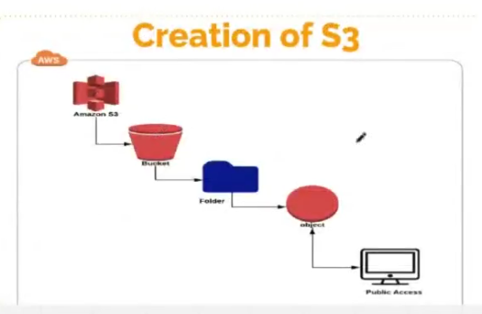


## AWS RDS - Relational Database Service

AWS RDS is a managed database service for relational databases.

RDS helps us create, run, backup, monitor, and scale databases without manually managing database servers.

Supported database engines:
- MySQL
- PostgreSQL
- MariaDB
- Oracle
- SQL Server
- Amazon Aurora

> Simple idea: **RDS is a managed database service. AWS handles a lot of database administration work.**

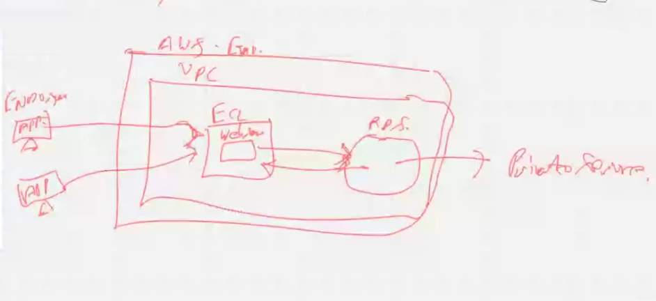

### Why RDS is Important

| Feature | Short detail |
|---------|--------------|
| Managed service | AWS manages database setup, patching, backups, and maintenance. |
| High availability | RDS can run with standby database in another Availability Zone. |
| Automated backups | RDS can automatically take backups and allow point-in-time recovery. |
| Read replicas | Extra database copies can be used to handle read traffic. |
| Security | Supports VPC, security groups, IAM integration, encryption, and database users. |
| Monitoring | Works with CloudWatch metrics and logs. |
| Scaling | Instance size and storage can be scaled based on need. |

### RDS High Availability

RDS can be used as a distributed database service for better availability.

In a Multi-AZ deployment:
- One database is the **primary database**.
- Another database is the **standby/secondary database**.
- If the primary fails, AWS can fail over to the standby database.
- This improves availability and reduces downtime.

```text
Application
    |
Primary RDS database
    |
Standby/Secondary RDS database in another AZ
```

> Simple idea: **Multi-AZ is mainly for high availability, not for increasing read speed.**

### RDS Replica Types

| Replica type | Purpose |
|--------------|---------|
| Standby replica / secondary database | Used for failover and high availability. |
| Read replica | Used to reduce read load from the primary database. |

### Primary vs Secondary Database

| Database | Role |
|----------|------|
| Primary database | Main database where application writes data. |
| Secondary/standby database | Backup live copy used if primary fails. |
| Read replica | Copy used mainly for read queries. |

### RDS vs Normal Database on EC2

| Feature | RDS | Database on EC2 |
|---------|-----|-----------------|
| Setup | Easy and managed by AWS | Manual installation and setup |
| Backups | Built-in automated backups | Need to configure manually |
| Patching | AWS helps manage patches | User manages OS and database patches |
| High availability | Multi-AZ option available | User must design and configure HA |
| Control | Less OS-level control | Full server control |
| Best for | Managed production databases | Custom database setup or full control needs |

### Important RDS Points

| Point | Detail |
|-------|--------|
| RDS is not serverless by default | We choose database instance type, storage, and engine. |
| RDS runs inside VPC | It can be placed in private subnets for security. |
| Public access should usually be off | Production databases should not be open to the internet. |
| Security group controls access | Only application servers should be allowed to connect. |
| Multi-AZ gives failover | Good for availability. |
| Read replica gives read scaling | Good when many users read data. |
| Backups protect data | Useful for restore and disaster recovery. |

> Simple idea: **Use RDS when you need a managed relational database with backup, security, monitoring, and high availability options.**


## Monolithic vs Microservices

A software application can be designed as one large application or as many small independent services.

### Monolithic Architecture

A monolithic application keeps most features in one codebase and deploys them together.

Example:

```text
Frontend + User logic + Payment logic + Order logic + Database logic
                    |
             One big application
```

| Point | Detail |
|-------|--------|
| Codebase | Usually one large codebase. |
| Deployment | Whole application is deployed together. |
| Scaling | Scale the full application even if only one part needs more resources. |
| Debugging | Easier in small projects, harder as app grows. |
| Best for | Small apps, simple projects, early-stage products. |

### Microservices Architecture

Microservices split the application into small services. Each service handles one business function.

Example:

```text
User service -> user data
Order service -> order data
Payment service -> payment data
Notification service -> emails/SMS
```

| Point | Detail |
|-------|--------|
| Codebase | Multiple small services. |
| Deployment | Each service can be deployed independently. |
| Scaling | Scale only the service that needs more capacity. |
| Communication | Services communicate using API, queues, or events. |
| Best for | Large applications, teams, and systems needing independent scaling. |

### Monolithic vs Microservices

| Feature | Monolithic | Microservices |
|---------|------------|---------------|
| Structure | One large application | Many small services |
| Deployment | Deploy everything together | Deploy services separately |
| Scaling | Scale whole app | Scale selected services |
| Development | Simple at start | Better for large teams |
| Failure impact | One bug can affect whole app | Failure can be isolated to one service |
| Complexity | Less distributed complexity | More network, monitoring, and deployment complexity |

> Simple idea: **Monolithic is one big app. Microservices are many small apps working together.**

---

## AWS Lambda

AWS Lambda is a **serverless compute service**.

It runs code without creating or managing servers like EC2.

Lambda is also **trigger based**, meaning it runs when an event happens.

> Simple idea: **Lambda runs code only when needed.**

### What is a Lambda Function?

A Lambda function is a small piece of code deployed to AWS Lambda.

It contains:
- Code.
- Runtime, like Python, Node.js, Java, Go, etc.
- Handler function.
- IAM role/permissions.
- Memory and timeout settings.
- Trigger or event source.

Example idea:

```text
Event happens -> Lambda function runs -> Task completed
```

### Lambda vs EC2

| Feature | AWS Lambda | EC2 |
|---------|------------|-----|
| Compute type | Serverless compute | Virtual server |
| Server management | AWS manages servers | User manages instance |
| Running time | Runs only when triggered | Runs continuously until stopped |
| Billing | Pay per request and execution time | Pay for instance running time |
| Scaling | Automatically scales | Need auto scaling configuration |
| Best for | Event-based tasks, APIs, automation | Long-running apps, full server control |

> Simple idea: **EC2 is like renting a server. Lambda is like running code only when an event happens.**

### Why Use Lambda?

| Reason | Detail |
|--------|--------|
| No server management | No need to patch, maintain, or scale servers manually. |
| Cost optimization | Good for workloads that run sometimes, not continuously. |
| Automatic scaling | Lambda can run many function instances in parallel. |
| Event driven | Works well with S3, API Gateway, DynamoDB, SQS, EventBridge, etc. |
| Fast development | Useful for small backend tasks and automation. |

### Lambda Triggers

A trigger is an AWS service or event that starts a Lambda function.

| Trigger | Example use |
|---------|-------------|
| API Gateway | Create REST API or backend endpoint. |
| S3 | Run code when a file is uploaded to a bucket. |
| DynamoDB Streams | Run code when database records change. |
| SQS | Process messages from a queue. |
| SNS | Process notification events. |
| EventBridge / CloudWatch Events | Run scheduled jobs like cron. |
| Application Load Balancer | Send web requests to Lambda. |

Example:

```text
User uploads image to S3
        |
S3 triggers Lambda
        |
Lambda resizes image
        |
Lambda stores output image back in S3
```

### How to Create Lambda Function

Basic steps:
- Open AWS Lambda service.
- Click **Create function**.
- Choose **Author from scratch**.
- Enter function name.
- Select runtime, like Python or Node.js.
- Create or select IAM execution role.
- Write or upload code.
- Configure memory and timeout.
- Add trigger, like S3, API Gateway, or EventBridge.
- Test the function with sample event.
- Monitor logs in CloudWatch.

### Important Lambda Settings

| Setting | Meaning |
|---------|---------|
| Runtime | Programming language environment. |
| Handler | Function entry point AWS calls. |
| Memory | RAM allocated to Lambda. More memory can also give more CPU power. |
| Timeout | Maximum execution time allowed. |
| IAM role | Permissions Lambda needs to access AWS services. |
| Environment variables | Key-value configuration values. |
| Layers | Shared libraries or dependencies used by functions. |
| Concurrency | Number of function executions that can run at the same time. |

### Common Lambda Use Cases

| Use case | Example |
|----------|---------|
| Serverless API | API Gateway -> Lambda -> DynamoDB/RDS |
| File processing | S3 upload -> Lambda -> image/video/document processing |
| Automation | Start/stop resources, cleanup old files, send alerts |
| Scheduled tasks | EventBridge schedule -> Lambda runs daily/hourly |
| Queue processing | SQS -> Lambda processes messages |
| Notifications | SNS/EventBridge -> Lambda sends email/SMS/update |
| Data processing | Process logs, streams, and events |

### Lambda Cost Optimization

Lambda can reduce cost because it runs only when needed.

| Cost factor | Meaning |
|-------------|---------|
| Number of requests | More invocations means more cost. |
| Execution duration | Longer-running functions cost more. |
| Memory size | More memory can increase cost but may reduce duration. |
| Data transfer | Moving data between services/Regions can add cost. |
| Provisioned concurrency | Keeping Lambda warm for low latency can add cost. |

Best for cost optimization:
- Infrequent jobs.
- Event-driven background tasks.
- Scheduled automation.
- APIs with variable traffic.
- Processing only when data arrives.

### Lambda Limitations

| Limitation | Detail |
|------------|--------|
| Not for all long-running jobs | Lambda has maximum execution time limits. |
| Cold start | First request after idle time may be slower. |
| Stateless | Function should not depend on local stored state. |
| Package size limits | Large dependencies need careful packaging/layers. |
| Debugging | Distributed logs and events need good monitoring. |

### Lambda with Other AWS Services

| Service | Lambda usage |
|---------|--------------|
| S3 | Process files after upload. |
| API Gateway | Build serverless APIs. |
| DynamoDB | Process database stream changes. |
| SQS | Process queue messages. |
| SNS | React to notifications. |
| EventBridge | Run scheduled or event-based automation. |
| CloudWatch | Store logs and monitor metrics. |
| IAM | Give secure permissions to Lambda. |

> Simple idea: **Lambda is best when code should run because something happened.**

## Project: Find Security Groups with Public Port 80 Access

This project checks all AWS Regions and finds how many Security Groups allow public HTTP access on port `80`.

Public access means inbound rule allows:
- `0.0.0.0/0` for IPv4.
- `::/0` for IPv6.

Port `80` is HTTP. If it is open to the public, anyone on the internet can try to connect.

### Project Architecture

```text
EventBridge schedule
        |
AWS Lambda function
        |
EC2 describe regions + describe security groups
        |
Find security groups with port 80 open to 0.0.0.0/0 or ::/0
        |
Publish result to SNS topic
        |
SNS sends email notification
```

### AWS Services Used

| Service | Use in project |
|---------|----------------|
| AWS Lambda | Runs the scanning code without managing EC2. |
| Amazon EC2 API | Lists Regions and Security Groups. |
| Amazon SNS | Sends email alert/report. |
| IAM Role | Gives Lambda permission to call EC2 and SNS. |
| EventBridge | Runs Lambda on schedule, like daily or hourly. |
| CloudWatch Logs | Stores Lambda execution logs. |

### Why Use Lambda for This Project?

| Reason | Detail |
|--------|--------|
| Serverless | No need to create and manage EC2 server. |
| Trigger based | Can run automatically using EventBridge schedule. |
| Cost optimization | Runs only during scan time, not 24/7. |
| Easy integration | Can call AWS APIs and send SNS notification. |
| Good for automation | Best for security checks, cleanup jobs, reports, and alerts. |

### Logic of the Lambda Function

Steps:
- Get list of enabled AWS Regions.
- For each Region, call `describe-security-groups`.
- Check inbound rules.
- Find rules where protocol is TCP and port `80` is allowed.
- Check if source is `0.0.0.0/0` or `::/0`.
- Count matching Security Groups.
- Prepare report with Region, Security Group ID, name, VPC ID, and rule.
- Publish report to SNS topic.

Example output idea:

```text
Public port 80 Security Group report

Region: ap-south-1
Security Group: sg-123456
Name: web-sg
VPC: vpc-123456
Issue: Port 80 open to 0.0.0.0/0

Total public HTTP security groups: 1
```

> Simple idea: **Lambda checks Security Groups and SNS sends the alert.**

---

## Amazon SNS - Simple Notification Service

Amazon SNS is a managed messaging and notification service.

SNS uses **topics** and **subscriptions**.

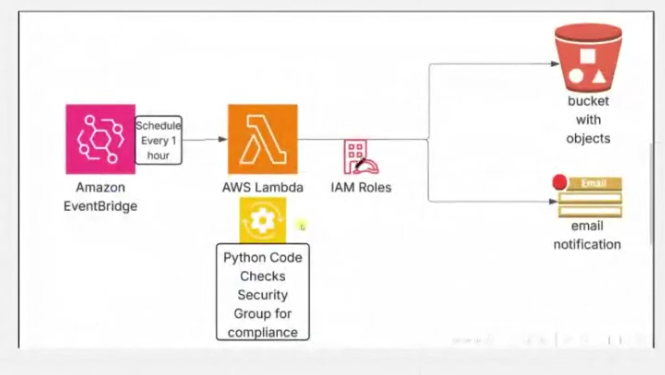

### SNS Topic

An SNS topic is like a message channel.

Publisher sends message to the topic, and SNS delivers the message to all subscribers.

```text
Publisher -> SNS Topic -> Subscribers
```

### SNS Subscription

A subscription connects an endpoint to an SNS topic.

The endpoint can be:
- Email address.
- AWS Lambda function.
- SQS queue.
- HTTP/HTTPS endpoint.
- SMS phone number.

### SNS Email Notification Flow

```text
Create SNS topic
        |
Add email subscription
        |
Confirm email subscription from inbox
        |
Publish message to topic
        |
SNS sends email
```

Important: For email subscriptions, the email owner must confirm the subscription before messages are delivered.

### SNS Topic vs Subscription

| Term | Meaning |
|------|---------|
| Topic | Message channel where messages are published. |
| Subscription | Connection between topic and receiver. |
| Publisher | Service/user that sends message to topic. |
| Subscriber | Receiver of message, like email, Lambda, or SQS. |
| Endpoint | Actual target address, like email ID or Lambda ARN. |

### SNS in Security Group Project

| Step | Detail |
|------|--------|
| 1 | Lambda completes Security Group scan. |
| 2 | Lambda creates summary report. |
| 3 | Lambda publishes message to SNS topic. |
| 4 | SNS sends email to subscribed email address. |

> Simple idea: **SNS sends notification to many receivers from one topic.**

---

## IAM for Lambda Security Project

IAM controls who can access AWS services and what actions are allowed.

For this project:
- Create an IAM policy.
- Create an IAM role for Lambda.
- Attach the policy to the role.
- Lambda uses the role to access EC2, SNS, and CloudWatch Logs.

### IAM Policy vs Role

| IAM item | Meaning |
|----------|---------|
| Policy | JSON permissions document. It says what actions are allowed or denied. |
| Role | Identity assumed by AWS services like Lambda. |
| User | Human or application identity with credentials. |
| Access key | Programmatic credential for IAM user. |

### IAM Flow for Lambda

```text
Create policy -> Create role -> Attach policy to role -> Assign role to Lambda
```

### Permissions Needed

| Permission | Why needed |
|------------|------------|
| `ec2:DescribeRegions` | To list AWS Regions. |
| `ec2:DescribeSecurityGroups` | To inspect Security Group inbound rules. |
| `sns:Publish` | To send report to SNS topic. |
| `logs:CreateLogGroup` | To create CloudWatch log group. |
| `logs:CreateLogStream` | To create Lambda log stream. |
| `logs:PutLogEvents` | To write Lambda logs. |

### IAM User, Access Key, and AdministratorAccess

| Item | Detail |
|------|--------|
| IAM user | Used for a human or application identity. |
| Access key | Used by AWS CLI or SDK for programmatic access. |
| IAM user policy | Permissions attached directly to a user. |
| `AdministratorAccess` | AWS managed policy with full access to AWS services and resources. |

Important:
- Avoid using root account access keys.
- Use least privilege instead of full `AdministratorAccess` for production.
- Store access keys safely.
- Rotate access keys regularly.
- Prefer IAM roles for AWS services like Lambda.

> Simple idea: **IAM policy defines permission. IAM role gives those permissions to Lambda.**

---

## AWS CLI

AWS CLI is a command line tool used to manage AWS services from terminal.

### AWS CLI Setup Idea

```bash
aws configure
```

It asks for:
- Access key ID.
- Secret access key.
- Default Region.
- Output format.

Access keys usually come from an IAM user.

### Useful AWS CLI Commands

Check which IAM user/role is being used:

```bash
aws sts get-caller-identity
```

List EC2 instances:

```bash
aws ec2 describe-instances
```

List Security Groups:

```bash
aws ec2 describe-security-groups
```

Find Security Groups with public port `80` in one Region:

```bash
aws ec2 describe-security-groups \
  --region ap-south-1 \
  --filters Name=ip-permission.from-port,Values=80 Name=ip-permission.to-port,Values=80 Name=ip-permission.cidr,Values=0.0.0.0/0
```

List all AWS Regions:

```bash
aws ec2 describe-regions --query "Regions[].RegionName" --output text
```

### AWS CLI Documentation Links

| Command / topic | Official docs |
|-----------------|---------------|
| `aws sts get-caller-identity` | https://docs.aws.amazon.com/cli/latest/reference/sts/get-caller-identity.html |
| `aws ec2 describe-instances` | https://docs.aws.amazon.com/cli/latest/reference/ec2/describe-instances.html |
| `aws ec2 describe-security-groups` | https://docs.aws.amazon.com/cli/latest/reference/ec2/describe-security-groups.html |
| AWS CLI config files | https://docs.aws.amazon.com/cli/latest/userguide/cli-configure-files.html |
| SNS create topic | https://docs.aws.amazon.com/sns/latest/dg/sns-create-topic.html |
| SNS create subscription | https://docs.aws.amazon.com/sns/latest/dg/sns-create-subscribe-endpoint-to-topic.html |
| Lambda with SNS | https://docs.aws.amazon.com/lambda/latest/dg/with-sns.html |

> Simple idea: **AWS CLI lets us test AWS identity, list resources, and debug Lambda permissions from terminal.**
