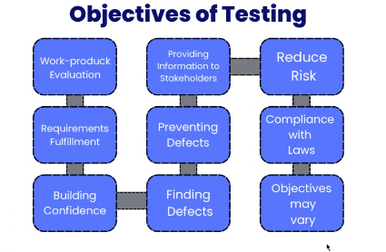
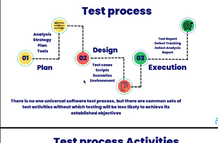

# Software Testing Notes

Software testing is the process of checking whether software works correctly and meets the required needs.

Testing helps to find:
- Bugs.
- Missing requirements.
- Wrong output.
- Performance or security issues.

> Simple idea: **Testing checks quality before software is delivered to users.**

---

## Static Testing

Static testing is done without running the program.

In static testing, we review documents, code, design, and requirements.

Examples:
- Requirement review.
- SRS review.
- Code review.
- Design review.
- Walkthrough.
- Inspection.

Advantages:
- Bugs are found early.
- Cost of fixing bugs is low.
- Improves requirement and code quality.

> Simple idea: **Static testing checks the software without execution.**

---

## Dynamic Testing

Dynamic testing is done by running the program.

In dynamic testing, testers give input and check the actual output.

Examples:
- Unit testing.
- Integration testing.
- System testing.
- Acceptance testing.

Advantages:
- Checks real software behavior.
- Finds functional bugs.
- Confirms the application works as expected.

> Simple idea: **Dynamic testing checks the software by executing it.**

---

## Verification and Validation



### Verification

Verification checks whether we are building the product correctly.

It is done using documents like SRS, design documents, and code.

Verification answers:

```text
Are we building the product right?
```

Examples:
- Check SRS document.
- Review design.
- Review code.
- Check whether requirements are correctly understood.

### Validation

Validation checks whether we built the correct product for the user.

It is done by running and testing the actual software.

Validation answers:

```text
Are we building the right product?
```

Examples:
- Functional testing.
- User acceptance testing.
- Alpha testing.
- Beta testing.

### Verification vs Validation

| Point | Verification | Validation |
|-------|--------------|------------|
| Meaning | Checks process/documents | Checks final software |
| Execution | Software is not executed | Software is executed |
| Type | Static testing | Dynamic testing |
| Based on | SRS, design, code review | User needs and actual output |
| Question | Are we building product right? | Are we building right product? |

> Simple idea: **Verification checks with SRS. Validation checks with user needs.**

---

## Test Levels



Test levels are different stages where software is tested.

Main test levels:
- Component or unit testing.
- Integration testing.
- System testing.
- Acceptance testing.

---

## Component and Unit Testing

Unit testing checks a small part of the software.

It is usually done by developers.

Examples:
- Test one function.
- Test one class.
- Test one module.

Purpose:
- Check if each small unit works correctly.
- Find bugs early.
- Make debugging easy.

Example:

```text
Test login password validation function separately.
```

> Simple idea: **Unit testing checks one small part at a time.**

---

## Integration Testing

Integration testing checks whether different modules work together.

It is done after unit testing.

Examples:
- Login module connected with database.
- Payment module connected with order module.
- Frontend connected with backend API.

Purpose:
- Find interface problems.
- Check data flow between modules.
- Check module communication.

Example:

```text
Check if user registration data is saved correctly in database.
```

> Simple idea: **Integration testing checks connection between modules.**

---

## Alpha and Beta Testing

### Alpha Testing

Alpha testing is done before releasing software to outside users.

It is usually done by internal testers or developers.

Purpose:
- Find major bugs before public release.
- Check software in a controlled environment.

Example:

```text
Company testers test the application inside the company.
```

### Beta Testing

Beta testing is done by real users before final release.

It is done in a real user environment.

Purpose:
- Get feedback from real users.
- Find bugs missed by internal testing.
- Check usability and real-world behavior.

Example:

```text
A few selected users try the app before public launch.
```

### Alpha vs Beta Testing

| Point | Alpha Testing | Beta Testing |
|-------|---------------|--------------|
| Done by | Internal team | Real users |
| Place | Company/testing environment | User environment |
| Time | Before beta testing | Before final release |
| Goal | Find major bugs internally | Get real user feedback |

> Simple idea: **Alpha is internal testing. Beta is real user testing before final release.**
